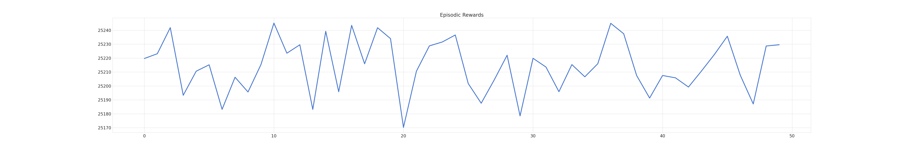

- DONE Change reward and actions
  collapsed:: true
  :LOGBOOK:
  CLOCK: [2024-03-27 Wed 15:25:36]--[2024-03-27 Wed 15:26:40] =>  00:01:04
  :END:
	- DONE rescale of action space during reward generation ?
	- DONE inclusion of action as part of net exchange
	  :LOGBOOK:
	  CLOCK: [2024-03-27 Wed 15:26:41]--[2024-03-27 Wed 16:42:43] =>  01:16:02
	  :END:
- DONE  Cumulative Reward for every episode ( figure )
  collapsed:: true
  :LOGBOOK:
  CLOCK: [2024-03-27 Wed 07:03:31]
  CLOCK: [2024-03-27 Wed 07:03:33]--[2024-03-27 Wed 09:27:01] =>  02:23:28
  :END:
	- Reward :
		- Net Exchange = Consumption - (- Generation)
		- Consumption Reward = max(0, Net Exchange) * Buy Price
		- Selling Reward = -1 * min(0, Net Exchange) * Sell Price
		- Action Reward (0.1 encourage if charging | -0.1 penalty if discharging )
		- Consumption reward + Generation reward + Action Reward
	- {:height 128, :width 719}
- DONE Graphics of the Results
  collapsed:: true
  :LOGBOOK:
  CLOCK: [2024-03-27 Wed 14:48:11]
  CLOCK: [2024-03-27 Wed 14:48:16]
  CLOCK: [2024-03-27 Wed 14:48:30]--[2024-03-27 Wed 15:25:03] =>  00:36:33
  :END:
	- DONE Plot ( action, power_household, pv_generation ) --- [i]
	  :LOGBOOK:
	  CLOCK: [2024-03-27 Wed 17:32:55]--[2024-03-27 Wed 19:16:55] =>  01:44:00
	  :END:
	- DONE Subplot (Net Power Consumpiton with [i])
- DONE Observation space after transition !!