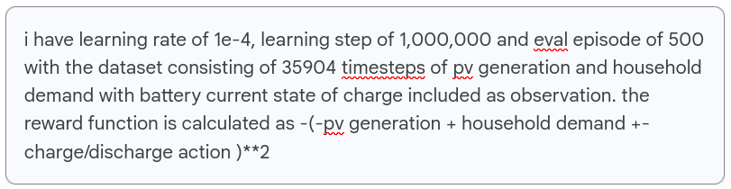

- 13:43:
- **Foundation of DRL** `Pieter Abbeel`
	- MDPs, Exact solution methods, Max. Entropy RL
	- Deep Q learning
	- Policy Gradient and Advantage Estimation
	- TRPO and PPO
	- DDPG and SAC
	- Model Based RL
- ___
- ```txt
  reward clipping (-1, 1)
  learning rate : 0.0009
  mini batch: 32
  exploration params for gradient stuct at local minima
  augmentation / vec. env
  ```
- Gemini Response
	- 
	- Here are some insights based on your PPO implementation details and the fluctuating reward issue:
	  
	  **Possible Causes:**
	  
	  1. **High Learning Rate (1e-4) for the complexity:** While 1e-4 is a common starting point, it might be too high for your specific problem. A complex environment with intertwined factors like PV generation, demand, and battery state of charge might require a lower learning rate to avoid large policy updates that cause instability. 
	  
	  2. **Limited Exploration (1 Million Steps):** With 1 million learning steps, the agent might not be adequately exploring the full range of possible actions, especially for a dataset size of 35904 timesteps. This could lead to getting stuck in local optima with fluctuating rewards.
	  
	  3. **Reward Function Design:** The squared term in your reward function might be overly sensitive to small deviations. This could cause the reward to fluctuate significantly even with minor changes in actions or state transitions.
	  
	  **Recommendations:**
	  
	  1. **Reduce Learning Rate:** Try a lower learning rate like 1e-5 or even lower (e.g., 1e-6) and see if the reward fluctuations decrease.
	  
	  2. **Increase Exploration:** Consider increasing the number of learning steps to allow for more exploration. You can also explore techniques like adding noise to the actions during training or implementing an intrinsic reward for exploration.
	  
	  3. **Refine Reward Function:** Analyze the reward distribution. If the squared term is causing large swings, consider a smoother function like absolute value or a hinge loss. 
	  
	  4. **Evaluate More Frequently:**  Evaluate the agent's performance on a separate validation set more frequently (e.g., every 100k steps) to monitor progress and identify if changes are helping. 
	  
	  **Additional Tips:**
	  
	  * **Experiment with Clipping Parameter:** The clipping parameter in PPO controls policy update magnitude. Experiment with different values (e.g., 0.2, 0.5) to find a balance between stability and learning speed. 
	  * **Normalize Observations:** Normalize the observations (PV generation, demand, etc.) to a similar scale to prevent any single feature from dominating the learning process.
	  
	  By adjusting these parameters and potentially refining your reward function, you might be able to achieve a more stable and progressive increase in reward during training.