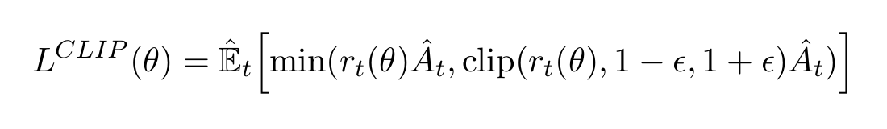
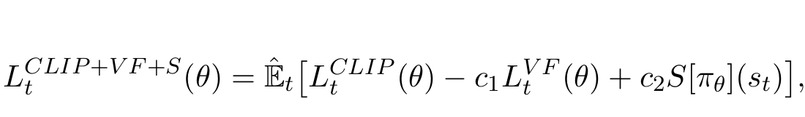

- PPO summary
	- 
	- With variance reduced advantage function estimation and entropy term for exploration, that is maximized each iteration.
	- 
- Feedback:
  collapsed:: true
	- DONE 7 days of 1k days training, i.e. (1000/5) repititions
	- DONE Evaluation frequency
	- DONE clip pv to be less than 0
	- DONE search params script
		- ```best_params_so_far@optuna
		  lr: 0.023088378088290833
		  gamma: 0.00023326374759796917
		  gae_lambda: 0.0016198614675570538
		  ent_coef: 8.69511672072916e-08
		  clip_range: 0.2865133069795921
		  n_epochs: 1
		  vf_coef: 4.65626247335199
		  target_kl: 0.0186409211575043
		  exponent_n_steps: 6
		  max_grad_norm: 0.3130188269348529
		  net_arch: tiny
		  User attrs: {'gamma_': 0.999766736252402, 'gae_lambda_': 0.9983801385324429, 'n_steps_': 64}
		  gamma_: 0.999766736252402
		  gae_lambda_: 0.9983801385324429
		  n_steps_: 64
		  ```
		- Remarks:
			- Include other parameters in search
				- n_epochs
				- clip_range_vf
				- rollout_buffer_kwargs
				- target_kl
				- mini batch_size
- Summary of Implemented Models.
	- PPO, SAC, TD3
		- Algorithms, Parameters, Evaluation Metrics, and  Scores Calc.
- Reward Diagnosis
	- Impact of different Components:
		- Hyperparameters
		- Dataset/ Features (processing)
		- Reward Function Estimation
		- Environmental Components