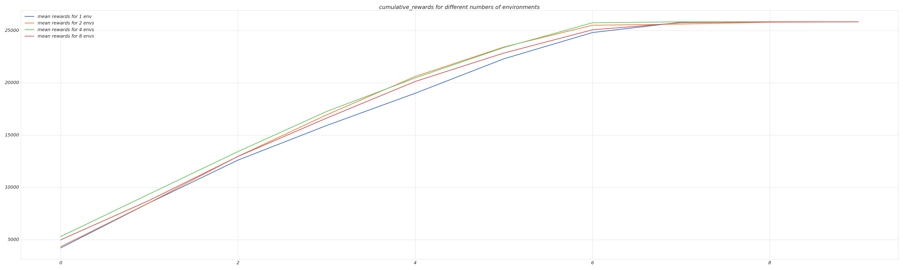

- DONE Adapt and move parameter changes to config
- DONE Run experiments with comparisons
  collapsed:: true
	- DONE  Amongst num of envs [1, 2, 4, 8] PPO
		- 
		- 8: (0.8 dataset)
		  collapsed:: true
			- ```
			  [
			  	[
			      	4983.99258,
			          8759.795257000002,
			          12959.654341,
			          16624.265101,
			          20128.213098999997,
			          22846.399217,
			          25067.894573,
			          25748.772326999995,
			          25835.863778,
			          25835.863778
			      ]
			  ]
			  ```
		- 4:
		  collapsed:: true
			- ```
			  [
			  	[
			      	5300.256641,
			          9374.706174000003,
			          13423.695701,
			          17257.138723000004,
			          20462.937714,
			          23374.550265,
			          25740.801901,
			   		25835.863778,
			          25835.863778,
			          25835.863778
			      ]
			  ]
			  ```
		- 2:
		  collapsed:: true
			- ```
			  [
			  	[
			      	4340.820596,
			          8540.655363,
			          12967.910917999998,
			          16936.18401,
			          20608.631873,
			          23425.974381, 
			          25506.138249000003,
			          25617.380933,
			          25794.513574999997,
			          25835.863778
			      ]
			  ]
			  ```
		- 1:
		  collapsed:: true
			- ```
			  [
			  	[
			      	4216.1244441,
			          8525.8031755,
			          12608.5871725,
			          15917.801024999999,
			          19001.169666,
			          22293.728826,
			          24808.833865,
			          25789.030227000003,
			          25814.826024999995,
			          25833.387752000002
			      ]
			  ]
			  ```
	- DONE  Amongst different observation sizes
	- DONE SAC, TD3, PPO
	- DONE Amongst hyperparameters