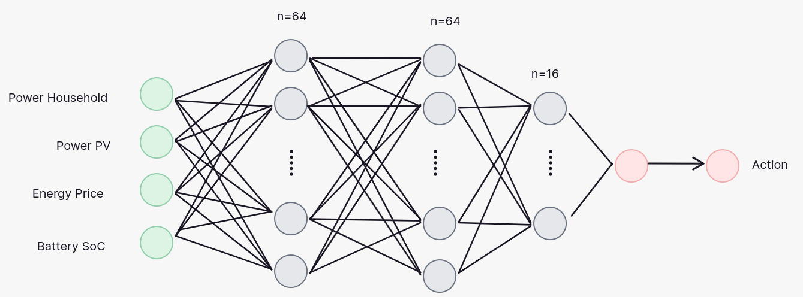
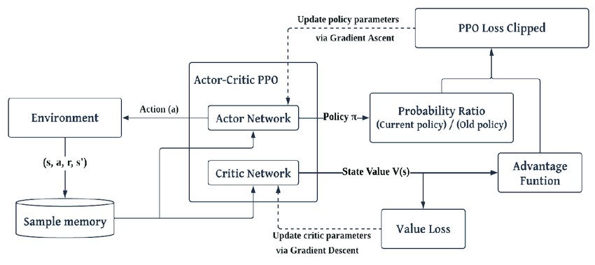
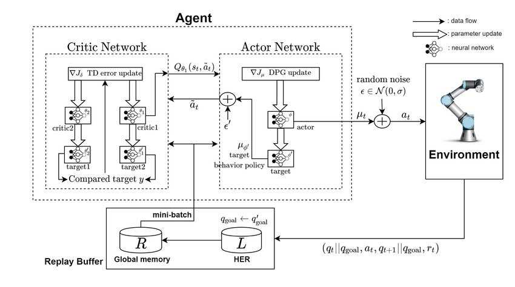
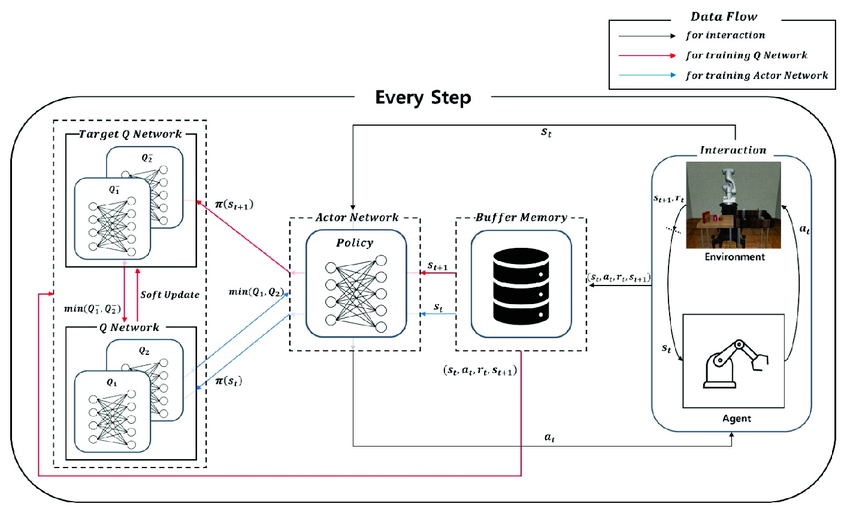

## PPO
	- 
	- 
	- [@](https://www.researchgate.net/publication/369776800/figure/fig1/AS:11431281137394180@1680642991760/Architecture-of-PPO-model.png)
- ## TD DDPG
	- 
	- [@](https://www.researchgate.net/publication/338605159/figure/fig2/AS:847596578947080@1579094180953/Structure-of-TD3-Twin-Delayed-Deep-Deterministic-Policy-Gradient-with-RAMDP.jpg)
- ## SAC
	- 
	- [@](https://www.researchgate.net/publication/371385495/figure/fig1/AS:11431281166275974@1686228230787/The-architecture-of-Soft-Actor-Critic-This-architecture-includes-processes-of-training.png)
-