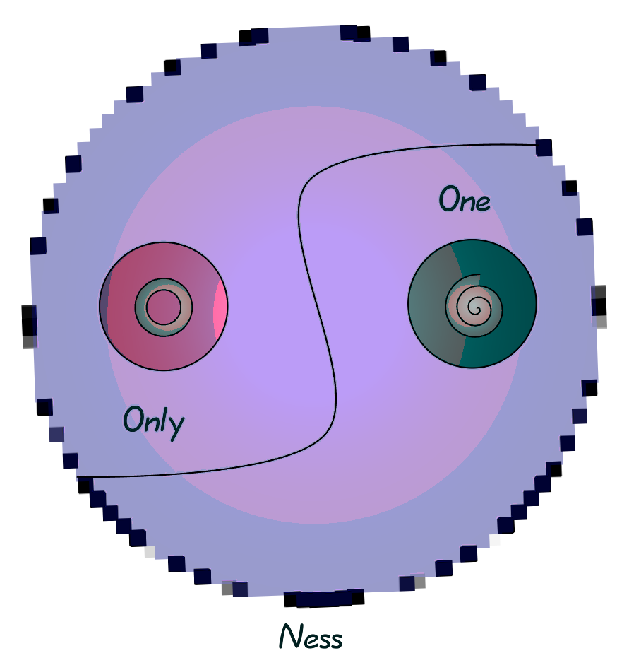
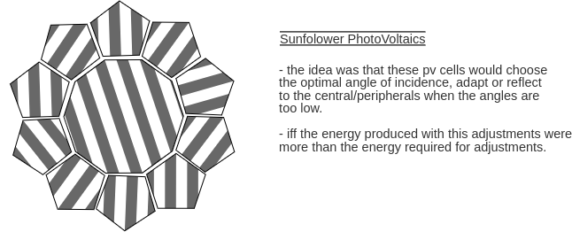

## Thoughts
collapsed:: true
	- Self Care
	  collapsed:: true
		- Hobbies
		  collapsed:: true
			- **Sound** [Audio]
				- Sound Design
				- String, Key, & Drum Instrumentals
				- Electronic Composition & Production
			- **Paper, Pencil, Graphics, & Lenses** [ Visuals ]
				- Literature
				- Sketching
				- Photo & Cinematography
				- Graphics & Animation
			- **Seasonal** [Dynamic]
		- Awareness
		  collapsed:: true
			- Mindful Sessions
			- Physical Awareness
			- Emotional & Intellectual Reflections
				- i have reasons to believe that i am highly sensitive person. !
			- $\mu$ Evolution
		- Cognition
		  collapsed:: true
			- Reading
			- Writing
			- Listening
			- Less Speaking
		- Values
		- Karma
		  collapsed:: true
			- "*What you do speak so loud, i can't hear what you say*"
			- Action toward values
		- Reflection
		  collapsed:: true
			- @Journal
			- "strength is exposure to vulnerability", "sensitivity provokes emotions to me the most", sounds(all sorts of ), smell, surprises, but wearing thicker shell is not my will"
		- On the Horizon
		- Off of Horizon
		- Socialization | Networking
		  collapsed:: true
			- Time with Friends & Family ❤️
			- **Communication**: Cell Phone, SMS, WhatsApp.
			- **Social I/O** : Instagram(personal),  Github(professional)
			- Exchanges and Novel Influences/Inspirations
	- Social
	  collapsed:: true
		- Personal Social responsibilities
		  collapsed:: true
			- Open source and Distributed systems [+]
		- Interpersonal Spaces
		  collapsed:: true
			- Love, mutual-Respect, Openness
	- Self-Social
	  collapsed:: true
		- 50%-50%
	- Fuzzy Thoughts, Self-journals
	  collapsed:: true
		- 07.04.224
		  collapsed:: true
			- It seems to, like any other visual stimulation and amplification, when cortical imagination ( ! assuming nCortexs one function as amplified primal ) gets to rest and sub-primal gets to consume, things like online media( shopping, click_baits, baiting, pornography, and other fantasy visuals ) gets space for execution. When the absence is at present and is filled with compulsion/fantasies instead of novel imaginations, thoughts.
			- It were consumed if the demand existed, either it exists and the demand is developed/marketed.
			- Keeping things away triggers the finder/seeker, suppression of queries through belief is stable to move over, however not fulfilling, not free*.
			- If not free to experience/explore and let go of ideas, concepts, belief once thought were sensible, what is open ? if opening bodies means only openness, other life is far ahead of sapiens. If changing thoughts and opinions as will is not well, it barely is Free*.
		- 14.06.2023
		  collapsed:: true
			- pursuit towards perfection often leads and through complexity to realize sheer beauty simplicity.
			- materials can bring joy as much as essential, spirit then is only limited by awareness.
			- One seeks moral and values, best version, ubermensch, a walk towards betterment, however reality enforcing a direction of causal wisdom, hence the praise of the ideal and pursuit of perfection ?
			- Control is tempting with awareness, but out of, hence the frustration and  egocentric, searching one that controls, if at all; GOD: a variable mean.
		- 11.06.2023
		  collapsed:: true
			- After a warm sonige Sonntag, a light clear sky revealed through partially close ambient curtains, pondering the depth of the sky and it's colors and evening birds soaring and returning. a reflection and dwell on companionship, a sloppy verge between over or under communication, liberation or conservation, understanding or conflicts, love or reality, a loud yet silent affection emerging abstract ways or a silent hate teaching self-love, fear of detachment as justification or unexpressed and constrained yet progressive love expressions as conflicted 1st century-ish moral burdens.
			- Often times meanings are created as mind unsettles on the conflicting perceptions, reduction is beautifully us, primal and efficient biologically i guess and better so unless instinct kick in and exhausts out as anger, stress, unease, insecure ... channels of fear.
			- i guess some i relate learn to adjust, adapt and learn to keep conflicts as wisdom well earned, and so emerges a reality navigator that is unbound to one perception bubbles bursting one after the other, only limited by awareness and attention, others and practically so, perhaps composition of  formally learned/influenced to realize, hypothesize, synthesize and perspectives as fits, to maybe progressively internalize the reality navigator exploring seas, sailing and surfing.
			- simplest of awareness can be a beautiful and revealing sometimes, other times heart as is, and prime nature made us try new, silly, novel, romantic frohkind moments.
			- Being free from cultural conformity bubbles one after another may be led to realize some space to over express, filtering safe zone, kind, smart and humble people, changed things within me, a financial freedom i know hard earned and depended on the shoulder of fore Families. With such support, forever grateful, a privileged that liberated my mind and few but special companions that made my heart less possessive, conservative and gentle shake a plant needed to grow thicker and stronger. A freedom of thought and liberty to update the meaning of surround, past, symbols, values, and perceptions maybe this is when we take off different thinking hats, but are slower to change and realize as solitude and space is where one reflects and recognizes self and external influences that compose us.
			- sometime materials values limit and narrows expressions and shakes ideally per suited values that was put to us, or make me more realistic and less formal, but in situation of feeling conflict when put a shake off of word, sm1 might be dreaming, and continue ease and understating with vulnerabilities and instincts, wherever lead us, do not have to define and confine to label ships* we shared, as far as we share mutual will. i guess we know us some and other situation, carry self-confirmed ideas and thoughts and foolish and sloppy hearts. Boundaries were eased not to unsease but to let in to roam, know and understand if, and free space to scatter colorful spirit.
			- Even good intentions were burden when not conveyed. i, self struggle a bit with composing thoughts and reminders on confrontation, instead adapt, wear shoes, hats and glasses, yet instantly eased and unsaid, grown when thoughts might have been added and felt. Borders were self understood and relationships open and unlabeled, yet same time  to push me away or to ease confront and resolve conflicts. but stay and talk, don't leave me in confusion, or hanging, its unsettling, not ghost. at least i want to feel if you feel me before as you want to test my love and intention to feel safe, it's about trusting us even doubted and theorized.
		- 27.05.2023
		  collapsed:: true
			- perception and understanding of primal, extreme and impulsive drivers on self.
			  collapsed:: true
				- It seems to me the spectrum of life *by default* (without outside influences and lessons) is aware of love and hate joy and sorrow, pain and pleasure, perspective as if it were black | white forgetting the shades the grey.
				- Fear: what one don't want/like to percieve, fear to experience is how and what one sees around, a box of perspective and projection of variable scale, scale depending on the subjective past experiences and influences. to spotlight through awareness, alert and impulsive, Fight or Flight, Confront or Avoid. otherwise, long-lasting and conservative  responses depending on the complexity of the neuronal cortices, most likely more amplified on human, uff.
				- personally aware, Fear of
				  collapsed:: true
					- letting go of the loved and attached
					- self fulfillment, satisfaction, incomplete experiences
					- fulfilling expectations and self over-expectation.
					- result of openness to all influences.
					- getting hurt in general, more psychologically than physiological.
				- Joy: One sees liberation, seeks unity, spreads and overloads love, pleasure, zone("a space of micro-evolution, expansion/merge of boundaries,") and overrides the other extreme half. Perhaps momentarily forgetting or even overcoming the heaviness that been rested upon and lifted off. Let go of the conserved, a space for seeking self- and inter-personal unity. Awareness for fear, alertness seem to be resting while, sharing, caring, boundary between self and the other seem to dissolve. lust of pleasure, love, ecstasy.
				- Hate, Pain, Anger (-ve stimuli)
				- Joy, Pleasure, Love (+ve stimuli)
				- Awareness {-ve range +ve }
		- 07.05.2023
		  collapsed:: true
			- If someone is not to guide one, if one had to outlie, go through self-criticism, changes and experience as the world is an adventure and exploration, experience and privilege, a blessing and a lesson. :))
			- flourished nourishment of west capitalism:
			  collapsed:: true
				- individualism at the core of the culture.
				- prime consumers of products, choices and services.
				- formal facades of social conformity, inherent, perhaps natural amongst conservative cultures, therefore layer of shadowed inter-personal interface.
				- foreigner among themselves. distrust, rather trust third party to project honest opinions than the second.
				- needed solidarity to fight for common good and ending with the enclosing applauses.
			- i see no point be nihilist or too much projective of my own perspective and willing chose not to be confirmed by following bubbles once i could see outside of one, bubbles inside bubble and a collection of bubble, bigger and smaller bubbles, more bubbles, yet ...
			- A world where romanticism, philosophy, psychology has become so ill viewed, temporarily but seldom, i have tempted will to want to conform myself among close companions and influences.
		- 02.05.2023
		  collapsed:: true
			- The story of how love was metaphorically blind because heart is  irrational, and perhaps conservative to few extreme colors of emotions, led to not see the reality that has grown around, mind on the other hand liberated to as far as imagination can see and the space it gets.
			- I think perhaps, is a slumber so deep indistinguishable from reality..., often lost in romantic fantasies, ecstatic dream and expectations, lust of unity, realized in ones own emotions and imagination, expressed only.... perceived through, the boundary and box of perspective and projection of the receiver where one choose to keep the other, space and scale highly dependent on habitants and extent of love-hops and self-love.
			- Reminds me of Cellular Automata, how even the simplest degree of freedom 
			  keeping thing in a simple framework (heart) causes ever-growing complexity.
		- Stack
		  collapsed:: true
			- Only consumers have the power to de-capitalize, the investment on the lust is what capitalizes to one that does not. be it ingestional, visual, multiform consumptions.
			- Why most hardworking people struggle with Gld. ? overflown to think while be-ing efficient and productive. desire is most effective when exhausted ?
		- wer
		  collapsed:: true
			- "Von morgen leuchten bis abend brot,
			  wer schaut und wer spielt
			  wer liebt noch und wer schon tot
			  wer wandern wo zu
			  wer blau, wer grun und rot
			  wer nicht was zu wissen
			  wer suche nach angebot"
		- "HopeBehindDopes"
		  collapsed:: true
			- It is but another day, day of race, comparative, relative, productive. Wonder how many colors human eyes can perceive yet, suppressed in cycles, compulsion. I often imagine a colorful world of einzigartig lunas, than where desires are caged in personas, narrated, being on a boat of projective & insecure perfections.  [3.5.24]
		- "Opened up the soul for love, either else, kinder self meaner
		  collapsed:: true
		  Walked up through every ones shoes, own sole getting thinner"
			- 
		- "Warheit" or "Wonder"
		  collapsed:: true
			- not sure what is worth, perhaps they somehow align themselves subjectively. **i think one should pursue their own**. A solider participating in both sides are convinced( not by self most cases ) in the pursuit of truth, sometime **biases of investment**, **dignity**, **a pursuit of purpose**, but ultimately it seems like a **deception** after all, so seems politics, likely the source of most wars, A deception of "wahr". one is more likely to fight for **anti stuff than pro stuff**, same amplified evolutionary instinct fight/flight perhaps, against something than for something, for differences rather than similarities. The only time we seem to unite is to, against something, fight to protect our previous, purposeful bubbles. Our only "solidarity" it seems to me is only time of alien intervention. 🌐
			- I prefer the latter and the former to manifest itself. Single candle for the sake of both light and absence of it, to bring shine and to project a shadow. **"inspired by everything, distilled by self, ones own persuit"**
		- It seem i have been smoking a lot lately perhaps the same reason for losing my stillness:
		  collapsed:: true
			- Primal Emos, Associative
				- Fear of Not meeting self expectations or skilled enough to achieve the will.
				- Grief/Panic: progressively developed sensitivity/ over-empathy subconsciously through reinforced repetitions, constant burdens.
			- Developed/Integrated Personality
				- Other Behaviors ( sub-conscious, compulsive, passionate attachments )
				- Habits ( instinctive more than rational )
			- Activities
				- Monotonic Schedules, Limited expressive channels, Absence of Workouts/Still sessions, Absence of Social Activities.
		- It seems to me, privileges real name is boredom, a field( likely where all the wonder, creation, morals, awareness, sarcasm, confusion, and forth... find their space ) out of prime urges. An opportunity to pursue ones will, be that loudest voices or abstract self expressions with nothing to say, longing to connect "."
- ## Ideas
	- ### Design
		- **Directions and intensity adaptive Energy Generation**:  Solar(PV), Lunar(Waves), Wind(both ?)
			- "sunflower"
				- {:height 270, :width 646}