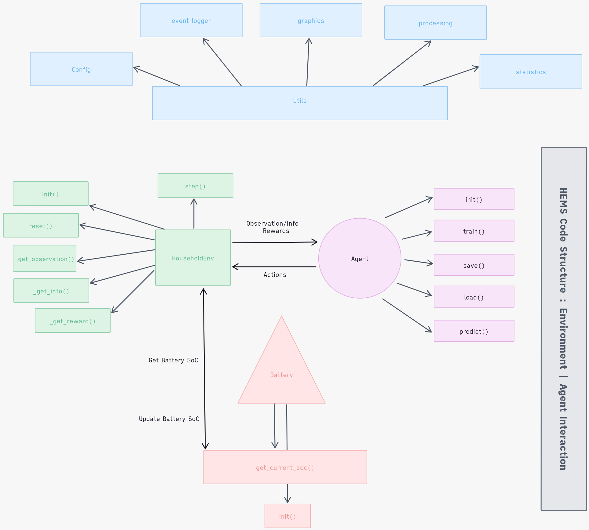

# Contents
	- ## Concepts
	  collapsed:: true
		- Literature Review
		  id:: 6618239f-46d2-4b30-a9d2-d649ab503757
		  collapsed:: true
			- Brief History/Evolution of HEMS.
			  id:: 65eec93e-0476-4b41-8296-f1368602aef3
			  collapsed:: true
			  :LOGBOOK:
			  CLOCK: [2024-04-25 Thu 10:13:51]--[2024-04-25 Thu 10:13:52] =>  00:00:01
			  :END:
				- LATER  History of HEMS systems (Papers)
				- LATER Rule based control
				- LATER Optimization problem
				- LATER Machine Learning based
				- LATER Deep Learning / RL Based.
				- LATER Relevant literatures / refererences for implementation
				- LATER Algorithms and Environment literatures
			- Papers to summarize for understanding
			  id:: 662a107d-7319-4a8b-89f1-f576c815105b
			  collapsed:: true
				- id:: 662231c4-aa14-4694-8379-f8cae08cbbd3
				-
				- LATER Proximal Policy Optimization (28 Aug 2017)
				  :LOGBOOK:
				  CLOCK: [2024-04-19 Fri 10:53:02]
				  CLOCK: [2024-04-19 Fri 10:53:09]--[2024-04-19 Fri 10:55:55] =>  00:02:46
				  :END:
				- LATER Soft Actor-Critic (SAC) (8 Aug 2018)
				- LATER Twin Delayed Deep Deterministic Policy Gradient (TD3) (22 Oct 2018)
				-
			- Referenced Paper : [Deep reinforcement learning for the optimized operation of large amounts of distributed renewable energy assets](https://www.sciencedirect.com/science/article/pii/S2666546822000611)
			  collapsed:: true
				- As a Household (Environment):
				  collapsed:: true
					- $$
					  \text{Total Grid Exchange} = \text{Power PV} + \text{Battery Discharge} - \text{Battery Charge} - \text{Power Household}
					  $$
					- $$
					  \text{Total Cost Exchange} = \text{Power Excess PV} * \text{Feed In Cost} - \text{Power Household Demand} * \text{Draw out Cost}
					  $$
				- Reward ( encourage/ discourage objectives )
				  collapsed:: true
					- Primary : Cost Reduction/ Self-Consumption
						- small discouragement for drawing out from the grid to encourage self  consumption of PV. since draw out price are more expensive that fed in prices, it implicitly reduces cost.
					- Secondary : Battery Health
						- The agent was encouraged(rewarded) for storing energy contents(to prevent draining, i.e. battery health preservation) in a battery at the end of trajectory.
					- discouraged on specified constraints.
					- Sum of Resulting Cost : Reward ( which the agent tend to maximize )
				- > Remark : Is it relevant to separate cost dependent reward from net cost to not add components of agents tendencies.
				- Agent
				  collapsed:: true
					- Its action : to determine an amount of power to charge/discharge from the battery storage / 15mins.
					- given observations as the state of the environment.
						- Static electricity price
						- Sum of (production - consumption)
						- Value for the SoC of the Battery storage.
					- action space : continuous [0,1],
					- observation space : continuous [-1, 1]
				- Pseudocode
				  collapsed:: true
					- ```
					  for episodes:
					  	exchange = generation - demand
					      if excess (exchange +ve):
					      	charge battery (BEV)
					          if battery full | max. charging speed reached:
					          	feed excess back to grid.
					      elif shortage (exchange -ve):
					      	try to cover shortage with battery.
					          if battery is empty | max. discharging reached:
					          	draw from the grid.
					  ```
				- Challenges identified
				  collapsed:: true
					- simulated environment, since real world training can be inconvenient, hazardous to train an agent to.
					- definition of reward function so that the desired agents behaviors are represented.
					- representation of the environmental features such that the agent is able to better understand. ( features extraction/selection )
					- Continuous action and observation space (infinite values between ranges)
					- Longer steps with delayed rewards:
						- larger number of steps(<35000)
					- Definition of Constraints/ Boundaries
						- rewarded feedbacks ensuring violatable constraints and boundaries preventing violation in physical constraints.
					- Definition of Benchmark
						- use of heuristic algorithm below ⬇️
						- Specht M., Madlener R. (2022). Quantifying Value Pools for Distributed Flexible Energy Assets, Energy, 263 (Part B): 125626. doi.org/10.1016/j. energy.2022.125626.
					- Difference in scale of **Values**
						- The variance in scale leading to instability.
						- Normalized the variance in observation and action spaces.
					- Need for training data
						- Multiple runs in data leads to overfitting policy
				- Env Implemented reference in a docX (@download)
		- Fundamental Concepts
		  collapsed:: true
			- Home Energy Management System
		- RL Progressive Dev.
		  collapsed:: true
			- Markov Decision Process
				- A Tuple $(S, A, P, R, \gamma)$
					- $S$ is finite set of states
					- $A$ is finite set of actions
					- $P$ is state transition probability matrix $P_{ss^{'}}^{a}$
					- $R$ is a reward function 
					  
					  $$
					  \boxed{
					  R_{s}^{a} = \mathbb{E}[R_{t+1} |S_{t} = s, A_{t} = a]
					  }
					  $$
					- $\gamma$ is a discount factor where $\gamma \in [0,1]$
					  
					  0: only next dependency, 1: infinite
			- Q Learning
				- $$
				  a(s) = argmax Q_{\theta}(s, a)
				  $$
		- Components
		  collapsed:: true
			- Data ETL
			  collapsed:: true
				- Extraction and Transformation of Dataset
				- Feature extraction/selection
				  collapsed:: true
					- consumption and usage behaviors
					- home battery state of energy
					- bev battery state of energy
					- static/dynamic pricing
			- *Environment* : simulated
			  collapsed:: true
				- Observation Space ( State Representation )
				  collapsed:: true
					- Power PhotoVoltaic, Power Household, Battery SoC
				- Action Space [ -11, 11 ]
				  collapsed:: true
					- Charging | Discharging rate of the battery
				- Reward Definition
				  collapsed:: true
					- Defining the desired behaviour
					  collapsed:: true
						- agents behaves to minimize cost by maximizing self-consumption through learned strategies.
					- Primary Objective
					  collapsed:: true
						- minimize grid usage/cost ( explicit )
						- maximize self-consumption of PV ( implicit )
					- Additional Constraints
					  collapsed:: true
						- Preserve battery soc to a range for BEV
						- Preserve battery health
					- Balance/combination of multiple objectives.
					  collapsed:: true
						- Reward function for in the context of energy management, directly influences the behavior and performance of the agent. In the case of HEMS considered, it is to reflect following objectives:
						- Meeting Household demand
						- Minimization of energy cost
						- Maximization of renewable use
						- Maintaining battery health
						- ## Objectives
						  
						  **Energy Cost** ($R_{cost}$)
						  
						  This objective ensures penalization of higher energy cost and reward lower cost and is realized by "difference between energy brought from the grid and the energy feed back"
						  
						  $$
						  \boxed{
						    R_{cost} = -(energy_{bought} * price_{buy}) + (energy_{sold} * price_{sell})
						  }
						  $$
						  
						  **Renewable Usage** ($R_{pv}$)
						  
						  This objective takes care of rewarding the agent for maximization of usage of self-generated PV
						  
						  $$
						  \boxed{
						    R_{pv} = \textbf{proportion of pv energy used}
						  }
						  $$
						  
						  **Meeting Demand** ($R_{demand}$)
						  
						  This objective ensures household demand is met without discomfort/ inconvenience.
						  
						  $$
						  \boxed{
						    R_{demand} = \left\{
						  \begin{array}{lr}
						    \text{high reward}  : \textbf{if} \text{ the demand is met} \\
						    \text{penalty}  : \textbf{otherwise}
						  \end{array}
						  \right.
						  }
						  $$
						  
						  **Maintaining Battery health** ($R_{battery}$)
						  
						  The Objective encourages the agent to keep the battery soc within optimal levels to prolong battery life.
						  
						  $$
						  \boxed{
						    R_{battery} = \left\{
						  \begin{array}{lr}
						    \text{high reward}  : \textbf{if} \text{ soc within optimal range} \\
						    \text{low reward}  : \textbf{otherwise}
						  \end{array}
						  \right.
						  }
						  $$
						  
						  **Overall Reward**
						  
						  $$
						  \boxed{
						    R_{total} = w_{cost}.R_{cost} + w_{pv}.R_{pv} + w_{demand}.R_{demand} + w_{battery}.R_{battery}
						  }
						  $$
						  
						  where $w_{cost}, w_{pv}, w_{demand}, w_{battery}$ are the weights to balance different objectives.
						  
						  ___
				- Reset/Initial State
				- State transition function ( Step Function )
				  collapsed:: true
					- Takes an action, simulates the environment, and returns the next observation, reward, done( Terminated, Truncated ) flag, and a Info dictionary.
				- Final State
				- Parallel Environments
			- *Policy (Agent)*
			  collapsed:: true
				- Train
				- Save/ Load ( retraining, testing, export for deployment )
				- Predict ( sample actions )
				- Policy Evaluation ( mean cumulative rewards )
			- *Batteries* : distributed energy assets
			  collapsed:: true
				- Given, pre-defined range of continuous(freq: 15mins) action and battery capacity,
				- Change in state of energy based on action taken by agent in the environment.
				- use of current state of energy as part of input observation and updated with the subsequent actions.
			- Hyperparameter tuning
			  collapsed:: true
				- Common parameters
				  collapsed:: true
					- Train timesteps
				- Model specific parameters
				  collapsed:: true
					- Learning rate
				- Combinatoric search
			- Evaluation Metrics
			  collapsed:: true
				- Track metrics like self-consumption rate, cost reduction.
				  collapsed:: true
					- Evaluation of performance of a HEMS can be done with the metrics reflecting it's efficiency, cost effectiveness, and sustainability. 
					  
					  **Self-consumption Rate**
					  
					  This metric measures the proportion of the energy generated by the PV system that is consumed by the household, as opposed to being fed back into the grid
					  
					  $$
					  \boxed{
					    \textbf{self consumption rate} = \frac{\text{energy consumed onsite}}
					                                      {\text{energy generated by pv}} * 100
					  }
					  $$
					  
					  **Cost reduction**
					  
					  This is the percentage reduction in energy cost due to the operation of HEMS compared to a baseline scenario without HEMS
					  
					  $$
					  \boxed{
					    \textbf{Cost Reduction} = (1- \frac{\text{Cost with HEMS}}
					                                       {\text{Cost without HEMS}}) * 100
					  }
					  $$
					  
					  **Grid Reliance**
					  
					  The dependency of the household on the grid or it's energy needs
					  
					  $$
					  \boxed{
					    \textbf{Grid Reliance} = \frac{\text{energy consumed from the grid}}
					                                      {\text{total energy consumed}} * 100
					  }
					  $$
					  
					  **Energy Autonomy**
					  
					  The degree to which the household can meet its energy demand without relying on the grid.
					  
					  $$
					  \boxed{
					    \textbf{Energy Autonomy} = \frac{\text{energy consumed from pv and battery}}
					                                      {\text{total energy consumed}} * 100
					  }
					  $$
					  
					  **Renewable Energy utilization**
					  
					  The total amount of renewable energy used by the household over a certain period
					  
					  $$
					  \boxed{
					    \textbf{RE Utilization} = \frac{\text{energy consumed from pv}}
					                                      {\text{total energy consumed}} * 100
					  }
					  $$
					  
					  ****
				- Identify key factors influencing optimal control strategies,
				  collapsed:: true
					- selection of input observation. (features, variability, states)
					- insensitive/near optimal parameters for the use case
					- definition of reward objectives to represent desired behaviors, (! reward hacking: agent learns to maximizes rewards without meeting objectives)
			- Sampling Action (Testing)
			  collapsed:: true
				- Replay Buffer
				- Logging Metrics
				- Visualization
		- Keywords/concepts
		  collapsed:: true
			- State(t_step) Observation(tuples)
			- (y) stepwise rewards (short term)/ episodic rewards (long term)
		- References
		  collapsed:: true
			- [energy-py](https://github.com/ADGEfficiency/energy-py/tree/main)
			  collapsed:: true
				- https://github.com/ADGEfficiency/energy-py/tree/main
			- [Using multi-agent Q learning to select best possible action for each of non-shiftable, power-shiftable and time-shiftable appliances](https://github.com/Megha-Bose/Home-Energy-Management)
			- [Farama-Foundation](https://github.com/Farama-Foundation) /  [Gymnasium](https://github.com/Farama-Foundation/Gymnasium)
			  collapsed:: true
				- ```
				  @misc{towers_gymnasium_2023,
				          title = {Gymnasium},
				          url = {https://zenodo.org/record/8127025},
				          abstract = {An API standard for single-agent reinforcement learning environments, with popular reference environments and related utilities (formerly Gym)},
				          urldate = {2023-07-08},
				          publisher = {Zenodo},
				          author = {Towers, Mark and Terry, Jordan K. and Kwiatkowski, Ariel and Balis, John U. and Cola, Gianluca de and Deleu, Tristan and Goulão, Manuel and Kallinteris, Andreas and KG, Arjun and Krimmel, Markus and Perez-Vicente, Rodrigo and Pierré, Andrea and Schulhoff, Sander and Tai, Jun Jet and Shen, Andrew Tan Jin and Younis, Omar G.},
				          month = mar,
				          year = {2023},
				          doi = {10.5281/zenodo.8127026},
				  }
				  ```
				-
			- [Stable Baseline](https://github.com/DLR-RM/stable-baselines3/tree/master)
			  collapsed:: true
				- ```
				  @article{stable-baselines3,
				    author  = {Antonin Raffin and Ashley Hill and Adam Gleave and Anssi Kanervisto and Maximilian Ernestus and Noah Dormann},
				    title   = {Stable-Baselines3: Reliable Reinforcement Learning Implementations},
				    journal = {Journal of Machine Learning Research},
				    year    = {2021},
				    volume  = {22},
				    number  = {268},
				    pages   = {1-8},
				    url     = {http://jmlr.org/papers/v22/20-1364.html}
				  }
				  ```
	- ## Implementation
	  id:: 6618239f-2175-4e3e-9575-08c9d7749387
	  collapsed:: true
		- > [Repository: HEMS-RLpy](https://github.com/Mnpr/HEMS-RLpy)
		- Design/ Graphics
		  collapsed:: true
			- Structure
			  collapsed:: true
				- 
			- i
			  collapsed:: true
				- 
			- ii.
				- 
		- Development
		  collapsed:: true
			- Data Preparation/ Features Selection
			  collapsed:: true
				- DONE Data Pre-Processing | Consuming Timeseries series columns (`Power PV`, `Power Household`)
				- DONE SoC recursive calculation for timesteps.
				- DONE Custom Dataset
			- Environment Development
			  collapsed:: true
				- Custom Environment: Gymnasium
				- Rule Based Control
				- Observations : Power Household, Power PV
				- Battery State : SoC
				- Reward Function : Energy Cost
					- ## Definition of Reward function
					  Reward function for in the context of energy management, directly influences the behavior and performance of the agent. In the case of HEMS considered, it is to reflect following objectives:
					- Meeting Household demand
					- Minimization of energy cost
					- Maximization of renewable use
					- Maintaining battery health
					- ## Objectives
					  
					  **Energy Cost** ($R_{cost}$)
					  
					  This objective ensures penalization of higher energy cost and reward lower cost and is realized by "difference between energy brought from the grid and the energy feed back"
					  
					  $$
					  \boxed{
					    R_{cost} = -(energy_{bought} * price_{buy}) + (energy_{sold} * price_{sell})
					  }
					  $$
					  
					  **Renewable Usage** ($R_{pv}$)
					  
					  This objective takes care of rewarding the agent for maximization of usage of self-generated PV
					  
					  $$
					  \boxed{
					    R_{pv} = \textbf{proportion of pv energy used}
					  }
					  $$
					  
					  **Meeting Demand** ($R_{demand}$)
					  
					  This objective ensures household demand is met without discomfort/ inconvenience.
					  
					  $$
					  \boxed{
					    R_{demand} = \left\{
					  \begin{array}{lr}
					    \text{high reward}  : \textbf{if} \text{ the demand is met} \\
					    \text{penalty}  : \textbf{otherwise}
					  \end{array}
					  \right.
					  }
					  $$
					  
					  **Maintaining Battery health** ($R_{battery}$)
					  
					  The Objective encourages the agent to keep the battery soc within optimal levels to prolong battery life.
					  
					  $$
					  \boxed{
					    R_{battery} = \left\{
					  \begin{array}{lr}
					    \text{high reward}  : \textbf{if} \text{ soc within optimal range} \\
					    \text{low reward}  : \textbf{otherwise}
					  \end{array}
					  \right.
					  }
					  $$
					  
					  **Overall Reward**
					  
					  $$
					  \boxed{
					    R_{total} = w_{cost}.R_{cost} + w_{pv}.R_{pv} + w_{demand}.R_{demand} + w_{battery}.R_{battery}
					  }
					  $$
					  
					  where $w_{cost}, w_{pv}, w_{demand}, w_{battery}$ are the weights to balance different objectives.
					  
					  ___
			- Algorithm Selection
			  collapsed:: true
				- Framework Selection : Stable Baseline3
				- Algorithms for Continuous Action spaces
				  collapsed:: true
					- PPO
					- SAC
					- TD3
		- Experimentation/ Observation
		  collapsed:: true
			- Optuna Hyperparam Search
			  collapsed:: true
				- id:: 665781fb-ee4f-4931-99f0-cd9d337ed1ba
				  |**Parameters**|**Defaults**|**PPO**|**SAC**| **TD3** |
				  |*len(train_obs)*|...|...|...|...|
				  |*learning_rate*|3e-4|...|...|...|
				  |*n_steps*|2048|...|-|-|
				  |*gamma*|0.99|...|...|...|
				  |*gae_lamnda*|0.95|...|...|...|
				  |*buffer_size*|...|...|...|...|
				  |*clip_range*|0.2|...|-|-|
				  |*tau*|...|...|...|...|
				  |*policy n/w*|...|...|...|...|
				  |*train_timesteps*|...|...|...|...|
				  |**Mean Celi. Reward**|...|...|...|...|
		- Results
		  collapsed:: true
			- Resulting Metrics
			  collapsed:: true
				- PPO
				  collapsed:: true
					- Train:
						- Episode Length :
						- KL Divergence: Approximate mean KL divergence b/w policies. Larger KL divergence destabilize learning, indicating not optimal hyperparameters.
						- Clip Fraction : High clip fraction indicates, $\eta$ is too high or Clipping parameter adjustment. (try adjusting clip range)
						- Clip Range : clip range of surrogate loss of PPO
						- Entropy Loss : Indicates agents exploration, a balance of increasing reward and some entropy.
						- Explained Variance : Fraction of the return variance explained by the value function
						- Learning Rate: step during gradient update
						- Loss (ppo): current total loss value
						- Policy Gradient Loss : High fluctuation indicates instability
						- Standard Deviation: standard deviation of the noise using gSDE
						- Value Loss : Lower value indicates towards accurate value function.
					- Eval: ( with EvalCallback )
					  collapsed:: true
						- Mean Episodic Reward:
						  collapsed:: true
							- Average reward throughout batched training episodes, steadily increasing mean reward suggests positive performance.
				- SAC
				  id:: 663b37fc-65ff-443b-a9e6-d1b4e0b289ab
				  collapsed:: true
					- Train:
						- Learning Rate
						- Actor Loss
							- It reflects the cost function optimization of the policy network Lower value generally indicates actors prediction aligning with the critics reward predictions.
						- Critic Loss
						- Entropy Coefficient
						- Entropy Coefficient Loss
					- Evaluation:
						- Mean_episode_length
						- Mean Episodic Reward:
							- Average reward throughout batched training episodes, steadily increasing mean reward suggests positive performance.
				- TD3
		- Deployment
		- Remarks
		  collapsed:: true
			- From referenced paper:
				- reward_range = (-900,900)
				- individual observation range (low, high)
			- Reward function is pretty stagnant:
				- Unsuitable Hyperparameters
				- Insufficient Data
				- Unsuitable Model Architecture.
			- Stable baseline uses older openai gym
			- Household Env however uses farma gymnasium
			- `self.env = DummyVecEnv([lambda: env])` !version mismatch
	- ## Reporting
	  collapsed:: true
		- ### Biweekly Reports
		  collapsed:: true
			- #### Report1
			  id:: 65e1cb14-6b82-4aa6-9e3b-3fe5271f3883
			  collapsed:: true
				- > **Biweekly Report 1.** ( $1^{st} Mar - 15^{th} Mar : 2024$ )
				- **Outline**
					- Environment Development
					- Integration with SB3
					- Tensorboard/ Structlog Logging
				- **1. Status/ Progress**
					- Current Iteration
					  id:: 65f47ec0-9855-4f33-8d00-80f3e4dc39ec
						- Custom Gymnasium Environment
					- Next Iteration( Plan )
				- **2. Concepts**
					- Main concept of reinforcement learning (RL) revolves around an **agent** learning to make decisions in an **environment** through trial and error, with the goal of maximizing a **reward**.  Key components of RL are :
					- 
					  
					  Fig. Agent-Environment Interaction$_1$
					- **Agent:** This is the entity that interacts with the environment. It can be any decision-making system.
					- **Environment:** This is the world or system the agent operates in. It provides the agent with feedback in the form of rewards or penalties based on its actions.
					- **State:** This represents the current situation in the environment relevant to the agent's 
					  decision-making. It's like a snapshot of the environment that the agent uses to decide what to do next.
					- **Action:** This is what the agent chooses to do in a particular state.
					- **Reward:** This is a numerical value assigned to the agent after it takes an action. Positive rewards indicate good choices, while negative rewards indicate bad choices. The reward function guides the agent's learning by shaping its understanding of what actions lead to desirable outcomes.
					- **Policy:** This is the strategy the agent uses to map states to actions. Through trial and 
					  error, the agent learns and refines its policy to make better decisions in the future.
					- This cycle of action, reward, and policy update continues as the agent learns through experience.
				- **3. Components**
					- Environment : It is a virtual representation of household's energy system. [Gymnasium](https://github.com/Farama-Foundation/Gymnasium)$_2$  library is used to develop custom Environments which then the learning algorithm can interact through APIs.
						- **Observation Space** : Observation space in gymnasium for HEMS environment defines a range of formats of information the agent receives in order to make decisions.
							- **Information used as System State**
								- State of Charge (SoC): Current battery level (e.g., percentage or normalized value)
								- Household Demand: Current power consumption of the household (e.g., kW)
								- PV Generation: Current power generation from the solar panels (e.g., kW)
							- **Data Type, Shape, and Range**
								- `dtype=np.float32` specifies the data type as 32-bit floating-point numbers.
								- shape=(3,) indicates the observation vector contains three elements.
								- low specifies the minimum value for each element in the observation vector:
									- `0.0`: Lower bound for normalized SoC (assuming 0 to 1 range)
									- `consumption.min()`: Minimum observed household demand
									- `genentation.min()`: Minimum observed PV generation
								- high defines the maximum value for each element:
									- `1.0`: Upper bound for normalized SoC
									- `consumption.max()`: Maximum observed household demand
									- `generation.max()`: Maximum observed PV generation
						- **Action Space**
							- The action space in a gymnasium environment defines the range and format of actions the agent can take within the environment.
							- An action(range of control signals) taken by agent to influence the environment in this case would be *Charging/Discharging Power* i.e. The amount of power to charge or discharge from the battery (e.g., kW). A continuous space is used here.
							- **Data Type, Shape, and Range**
								- `dtype=np.float32` specifies the data type as 32-bit floating-point numbers.
								- `shape=(1,)`: Representing a single action value (charging/discharging power)
								- `low=-11` and `high=11`: Assuming valid charging/discharging power ranges from -11 kW (discharging) to 11 kW (charging).
						- **Reward Estimation Function**
							- The reward function plays a crucial role in shaping the agent's behavior in a reinforcement learning environment. In case of HEMS scenario using PPO, we can define a reward function as composition of following Objectives/ Constraints:
							- **Objectives:**
								- **Meet household demand:** Ensure the agent prioritizes meeting the household's energy needs.
								- **Minimize grid dependence:** Promote self-sufficiency by utilizing PV generation and minimizing reliance on the grid.
								- **Maximize battery health:** Encourage the agent to avoid extreme charging and discharging rates that can degrade the battery.
							- **Reward Components:**
								- **PV Generation Utilization:** Reward the agent for using generated solar power to meet demand.
									- $$
									  
									  \boxed{
									  
									    R_{PV} = min(D, G) \cdot \beta
									  
									  }
									  
									  $$
									  
									  Where,
									- $R_{PV}$: PV generation utilization reward
									- $D$: Household demand for power (kW)
									- $G$: PV generation (kW)
									- $\beta$: Weight for PV utilization (positive value)
									  
									  It rewards the agent for using generated solar power ($G$) to meet demand ($D$). The min function ensures the reward is based on the minimum of these two values, preventing situations where generation exceeds demand. The weight ($\beta$) controls the significance of PV utilization in the overall reward.
								- **Grid Dependence Penalty:** Penalize the agent for drawing power from the grid, especially during peak demand periods (optional).
									- $$
									  
									  \boxed{
									  
									    R_{grid} = - \gamma \cdot max(0, D - G)
									  
									  }
									  
									  $$
									  
									  Where,
									- $R_{grid}$: Grid dependence penalty
									- $\gamma$: Weight for grid dependence (positive value)
									- $D$: Household demand for power (kW)
									- $G$: PV generation (kW)
									- It penalizes the agent for drawing power from the grid. The $max(0, D - G)$ ensures the penalty is only applied when demand exceeds generation (positive value). The weight ($\gamma$) determines the severity of the penalty for grid reliance.
								- **SoC Stability:** Penalize large deviations from a desired SoC range (e.g., reward staying within a comfortable battery level).
									- $$
									  
									  \boxed{
									  
									    R_{SoC} = -\alpha |SoC - SoC_{desired}|
									  
									  }
									  
									  $$
									  
									  Where,
									- $R_{SoC}$: SoC stability reward
									- $\alpha$: Weight for SoC stability (positive value)
									- $SoC$: Current state of charge of the battery (0 to 1)
									- $SoC_{desired}$: Desired SoC range center (e.g., 0.5 for a range of 0.2 to 0.8)
									  
									  The higher the weight ($\alpha$), the stricter the penalty for deviating from the desired range.
								- **Total Reward :**
									- $$
									  
									  \boxed{
									  
									    R_{total} = w_1 R_{SoC} + w_2 R_{PV} + w_3 R_{grid}
									  
									  }
									  
									  $$
									  
									  Where,
									- $R_{total}$: Total reward received by the agent
									- $w_1, w_2, w_3$: Weights for each reward component (positive values)
							- **Remarks:**
								- Weights can be adjusted for each reward component to prioritize different objectives, such as energy prices, and environmental goals.
								- The SoC stability reward penalizes deviations from the desired SoC range (e.g. 0.2 to 0.8).
								- The PV generation utilization reward encourages using solar power by multiplying minimum (demand, generation) with a weight.
								- The grid dependence penalty discourages grid reliance by penalizing the difference between demand and generation when positive (grid usage).
								- Finally, the total reward combines these components with specified weights.
						- **Data Processing**
							- Action Space is normalized between (-1, 1) and re-scaled back to (-11, 11), considering computational ease.
							- Observation Space is normalized between (0, 1), and as a tuple (soc, demand, generation) for each state. Demand and generation features are taken as rolling average of window 3.
					- Algorithm : This is the core learning mechanism that allows the agent to improve its decision-making over time through trial and error. [Stable Baselines](https://github.com/DLR-RM/stable-baselines3) $_3$ is used for RL algorithms, that integrates with Custom Gymnasium Environment.
					- Agent : This is the decision-making unit that employs reinforcement learning to control the battery. The implementation consists of methods to
					- Training : The agent interacts with the simulated environment, taking actions (battery charge/discharge decisions) based on the current state and the RL algorithm's policy.
						- It receives rewards based on the defined reward function and learns from these experiences.
						- Over numerous training iterations, the agent refines its policy to make better decisions in the future.
				- **4. Reference/ Literatures**
					- [1. ] [Reinforcement Learning: An introduction (Second Edition) by Richard S. Sutton and Andrew G. Barto](https://mitpress.mit.edu/9780262039246/reinforcement-learning/)
					- [2. ] [Gymnasium](https://zenodo.org/records/10655021) An API standard for single-agent reinforcement learning environments, with popular reference environments and related utilities.
					- [3.] [Stable-Baselines3](http://jmlr.org/papers/v22/20-1364.html) Reliable Reinforcement Learning Implementations, Antonin Raffin and et. al.
				- **Common Terminologies**
					- **HEMS (Home Energy Management Systems) :**  A combination of hardware and software components that work together to efficiently manage the energy usage of a home.
					- **Grid:**  The electrical network that transmits and distributes electricity to consumers.
					- **Energy Consumption:** The total amount of electrical power used by a household over a period. Measured in kilowatt-hours (kWh).
					- **Demand Response (DR):** It is an adjustment of energy usage within a household in response to signals from the grid operator or energy market, often shifting the electricity usage to off-peak periods.
					- **Peak Demand:** The highest level of power usage within a specific timeframe
					- **State of Charge (SOC):**  The remaining capacity of a battery expressed as a percentage. ( often between [0,1] ).
					- **Agent:** An entity that interacts with an environment and learns to take actions that maximize a reward.
					- **Environment:**  The system where the agent operates. It provides feedback in the form of rewards and penalties.
					- **State:**  A representation of the current situation in the environment relevant to the agent's decision-making.
					- **Action:**  An action chosen by the agent that affects the environment.
					- **Reward Function:**  A function that assigns a numerical value (reward) for each action the agent takes. Guides the agent's learning.
					- **Policy:**  A set of rules that the agent uses to map states to actions.
					- **Exploration vs. Exploitation:**
					  The balance between trying new actions (exploration) and exploiting the actions known to be good (exploitation) during learning.
					- **Discount Factor:**  A value between 0 and 1 that determines how much the agent prioritizes immediate rewards vs. future rewards.
				- ___
			- #### Report2
			  id:: 65eb41fd-f028-4379-b0cc-51c7654a44d4
			  collapsed:: true
				- > **Biweekly Report 2.** ( $16^{th} Mar - 31^{st} Mar : 2024$ )
				- **Outline**
					- Environment Setup
						- Reward/ Observation space
						- Reorganize dir/ setup for registration
					- Literature Review
					- Algorithm Selection
						- according to review and stable baselines.
					- Evaluation plan, setup and possibilities.
				- **1. Status/ Progress**
				- **2. Concepts**
				- **3. Components**
				- **4. Reference/ Literatures**
			- #### Report3
			  id:: 6618239f-9195-42cb-b41b-0b86ed9956f2
			  collapsed:: true
				- > **Biweekly Report 3.** ( $1^{st} Apr - 24^{th} Apr : 2024$ )
				- **Outline**
					-
			- #### Report4
			  id:: 6618239f-3614-4f3c-b28a-9736d2799804
			  collapsed:: true
				- > **Biweekly Report 3.** ( $25^{th} Apr - 6^{th} May : 2024$ )
				- **Outline**
					- Status/ Progress
					- Components
						- Environment
							- Simplification in reward function
								- simplified
								- quadratic
								- omitting cost based reward function
							- Simplified episodic experiences as csv
						- Battery
							- fixed issues with get soc to the env.
						- Agent
							- Added Soft Actor Critic for comparison
						- Miscellaneous
							- Added cli argparse for train,save_experience save_graphics
						- Grphics/Logs
							- Improved / Additional Graphics
								- PPO
									- Observation relative action
									- Observation relative rewards
									- I/O comparison Graphics
										- Generated PV/ Demanded Household
										- Before normalization/ After Denormalization
										- After normalization / Before Denormalization
									- Cumulative rewards
								- SAC
									- Observation relative action
									- Observation relative rewards
									- I/O comparison Graphics
										- Generated PV/ Demanded Household
										- Before normalization/ After Denormalization
										- After normalization / Before Denormalization
									- Cumulative rewards
					- Reference
			- #### Report5
			  id:: 6618239f-848e-4862-a387-4ae0cc60211e
			- #### Report6
			  id:: 6618239f-7360-462e-9587-c036411c6f79
			- #### Report7
			  id:: 66538907-a98b-44dc-b161-b5930bf5402d
			- #### Report8
			  id:: 66538907-2623-4d56-a644-70cc697e8e61
			- #### Report9
			  id:: 665866bd-478d-4b4e-a25a-4af8170b96e5
		- ### Final Report
		  id:: 66538907-17d3-4cd1-afb0-c26f4d7363e9
		  collapsed:: true
			- Outline
			  id:: 65eb41fd-5cdb-4e14-ad3b-cacc8e38aae9
				- Abstract
				- Acknowledgement
				- Contents
					- 1.Introduction
					- 2.HEMS Domain, Evolution upto RL
					- 3.Design/ Components / Artchitectures
					- 4.Implementation
					- 5.Observations
					- 6.Results
					- 7.Deployment
				- Conclusion
				- Bibliography
	- **TimeLine**
	  collapsed:: true
		- Month I ( $01.03.2024 - 31.03.2024$ )
			- ((65e1cb14-6b82-4aa6-9e3b-3fe5271f3883))
			- ((65eb41fd-f028-4379-b0cc-51c7654a44d4))
		- Month II ( $01.04.2024 - 30.04.2024$ )
		  collapsed:: true
			- ((6618239f-9195-42cb-b41b-0b86ed9956f2))
			- ((6618239f-3614-4f3c-b28a-9736d2799804))
		- Month III ( $01.05.2024 - 31.05.2024$ )
		  collapsed:: true
			- ((6618239f-848e-4862-a387-4ae0cc60211e))
			- ((6618239f-7360-462e-9587-c036411c6f79))
		- Month IV ( $01.06.2024 - 30.06.2024$ )
		  collapsed:: true
			- ((66538907-a98b-44dc-b161-b5930bf5402d))
			- ((66538907-2623-4d56-a644-70cc697e8e61))
		- Month V ( $01.07.2024 - 31.07.2024$ )
		  collapsed:: true
			- ((665866bd-478d-4b4e-a25a-4af8170b96e5))
			- ((66538907-17d3-4cd1-afb0-c26f4d7363e9))
	- **Docs/Remarks**
	  collapsed:: true
		- Problem statement/ Description of the objective
		- Introduction and Fundamental concept of HEMS
		- Evolution of HEMS: for cost minimization
			- user centric visualization of consumption (limitations)
			- rule/strategy based automated control (limitations)
			- model predictive control : mathematics model for optimization, prediction and control. (limitations)
			- rl based optimization and control. (limitations)
		-
			-