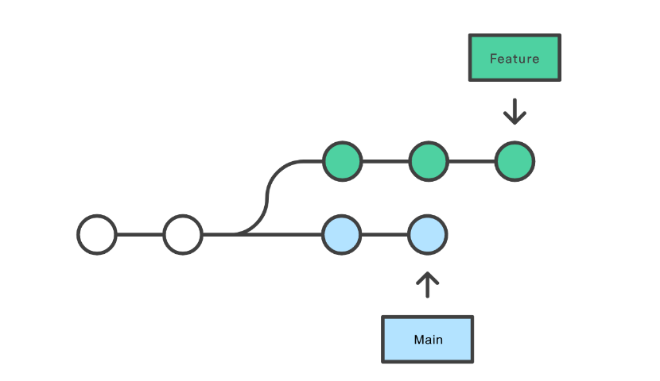

- Uses SHA-1 hash for checksumming.
- has three main states that files can reside in: *modified*, *staged*, and *committed*.
- **git cli manual**
  collapsed:: true
	- ```shell
	  $ git help <verb>
	  $ git <verb> --help
	  $ man git-<verb>
	  ```
- **git config** : initial setup of config variables
  collapsed:: true
	- config overview: `git config --list --show-origin`
	- system-wide `/etc/gitconfig` | (git config --system)
	- user-local `~/.gitconfig` | `~/.config/git/config` (git config --global)
	- repo-specific `./git/config` (git config --local)
	- > each level overrides the previous one.
	- adding ownership of the commits:
	  collapsed:: true
		- `git-config --global --add user.name "YOUR NAME"`
		- `git-config --global --add user.email "YOUR EMAIL"`
	- editor: `git config --global --add core.editor "vim"`
	- `git config --global pull.rebase "true"` rebase when pulling.
- **Basics workflow**
  collapsed:: true
	- **git init** : initialization of local repository
	- **git clone**: get a copy of remote repository
	- `.gitignore`: file containing ignored files/directories in a repository
	- **git status** | `git status -s`: get a status of the repository
	- **git diff**: overall changes in files (i.e. difference)
	  collapsed:: true
		- `git diff --staged`| `git diff --cached`: changes staged
	- **git add**: tracking changed files into staging
	- `git remove --staged <filename>` | `git remove --staged | --cached <filename>` : unstaging a file
	- **git commit -m "short msg about changes"**: commit changes from staging
	- **git log**: view commit history
		- `git log --patch -2`: e.g. changes in last 2 patches
		- `git log --stat` : summarized changes in each commit
- **Undo changes**
  collapsed:: true
	- `git commit --amend`: undo commit to staging area, iff no changes were made since the last commit to amend.
	  collapsed:: true
		- ```shell
		  $ git commit -m 'Initial commit'
		  $ git add forgotten_file
		  $ git commit --amend
		  ```
	- `git reset` : undo changes through [HEAD(pointer to latest comitted change), Index(staged change), Working Directory] depending on the type of reset
		- `git reset [<mode>] [<commit>]`
			- modes:
				- `--soft`
					- 
				- `--mixed`
					- 
				- `--hard`
					- 
				- `--merge` & `--keep`
				- more @ `git reset -h`
	- `git restore` : restore changes in worktree and staging
	  collapsed:: true
		- `git restore --worktree <file>`: undoing changes in wortree
		- `git restore --staged <file>`: undoing changes in staging
- **Remotes**
  collapsed:: true
	- `git remote -v` : info on remote repository/ies
	- `git remote add <remote-repository>`: add remote repo to current workdir
	- `git remote show origin`: info on remotes
	- `git remote rename <altname> <neuname>`: rename remotes
	- `git remote remove <aktuellname>`: remove remote
	- `git fetch <remote-repository>` : fetch changes from remote
	- `git push origin <branch>`: push changes to the remote
- **Branching**
  collapsed:: true
	- `git branch <newbranchname>`: create a branch
	- `git stash`: stash uncomitted changes before switching branch
	- `git stash pop`: restore uncomitted changes.
	- `git checkout <branchname>`: switching branches
	- `git checkout -b <newbranchname> <[opt: branchfrom]> `: create and switch branch with optional branch to branch from.
	- stash changes : `git stash`
	- **Git graph**
	  collapsed:: true
		- ```shell
		  git log --oneline --decorate --graph --all
		  ```
- **Merging Workflows**
	- **git merge**: basic merge
		- `git checkout <branchtomergeto>`
		- `git pull origin <branchtomergeto>`
		- `git merge <branchmerging>`
		- `git push -u origin <branchtomergeto>`
		- one liner : `git merge <branchtomergeto> <branchmerging>`
	- **git rebase**:
	  collapsed:: true
		- `git checkout <branchtomergeto>`
		- `git rebase <branchmerging>` (auto rebasing)
		- **interactive rebasing** (cherry picking commits)
		  collapsed:: true
			- `git rebase -i <branchmerging>`
	- Merging and Rebasing:
	  collapsed:: true
		- Features
		  collapsed:: true
			- 
		- Merging with `git merge`
		  collapsed:: true
			- 
		- Merging with `git rebase`
		  collapsed:: true
			- 
			-
- [Mailmap](https://git-scm.com/docs/gitmailmap): ownership of the commit.
- ## Pre-commit Hooks
  collapsed:: true
	- `pip install pre-commit`
	- `touch .pre-commit-config.yaml`
	  collapsed:: true
		- ```
		  repos:
		  -   repo: https://github.com/pre-commit/pre-commit-hooks
		      rev: v2.3.0
		      hooks:
		      -   id: check-yaml
		      -   id: end-of-file-fixer
		      -   id: trailing-whitespace
		  ```
	- `pre-commit run --all-files`
	- `pre-commit install`
	- Setup Linter, Formatter, & Checkers
	  collapsed:: true
		- formatter/ linter/ checker config file:
		  collapsed:: true
			- ```setup.cfg
			  [flake8]
			  max-line-length=120
			  [isort]
			  profile = black
			  [black]
			  line-length=120
			  ```
		- pre-commit config file :
		  collapsed:: true
			- ```.pre-commit-config.yaml
			  repos:
			      - hooks:
			        - id: check-added-large-files
			        - id: check-json
			        - id: check-yaml
			          args: [--allow-multiple-documents]
			        - id: mixed-line-ending
			        - id: trailing-whitespace
			        repo: https://github.com/pre-commit/pre-commit-hooks
			        rev: v3.2.0
			      - repo: https://github.com/pycqa/isort
			        rev: 5.12.0
			        hooks:
			        - id: isort
			          name: isort (python)
			      - hooks:
			        - id: flake8
			        repo: https://github.com/pycqa/flake8
			        rev: 6.0.0
			  	- repo: https://github.com/psf/black
			        rev: 22.10.0
			        hooks:
			        - id: black
			  ```
- **Resources**
  collapsed:: true
	- [1.] [[pre-commit](https://pre-commit.com/)]
	- [2.] [[isort](https://pycqa.github.io/isort/index.html)]
	- [3.] [[black](https://black.readthedocs.io/en/stable/)]
	- [4.] [[flake8](https://flake8.pycqa.org/en/latest/)]
	- [5.] [[git](https://git-scm.com/doc)]
- **References**
  collapsed:: true
	- [Merging vs. rebasing](https://www.atlassian.com/git/tutorials/merging-vs-rebasing)