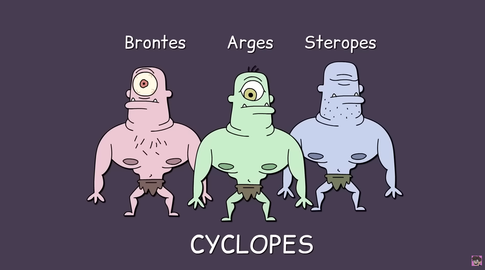

- Ancient mythologies.
  collapsed:: true
	- ### Bronze Age
	  collapsed:: true
		- [Hindu mythology](https://en.wikipedia.org/wiki/Hindu_mythology)
		- [Canaanite mythology](https://en.wikipedia.org/wiki/Ancient_Canaanite_religion)
		- [Chinese mythology](https://en.wikipedia.org/wiki/Chinese_mythology)
		- [Egyptian mythology](https://en.wikipedia.org/wiki/Egyptian_mythology)
		- [Hittite mythology](https://en.wikipedia.org/wiki/Hittite_mythology_and_religion)
		- [Hurrian mythology](https://en.wikipedia.org/wiki/Hurrian_religion)
		- [Sumerian mythology](https://en.wikipedia.org/wiki/Sumerian_mythology)
		- [Persian mythology](https://en.wikipedia.org/wiki/Persian_mythology)
		- [Proto-Indo-European mythology](https://en.wikipedia.org/wiki/Proto-Indo-European_mythology)
		- [Proto-Indo-Iranian mythology](https://en.wikipedia.org/wiki/Proto-Indo-Iranian_religion)
	- ### Iron Age
	  collapsed:: true
		- [Celtic mythology](https://en.wikipedia.org/wiki/Celtic_mythology)
		- [Classical mythology](https://en.wikipedia.org/wiki/Classical_mythology)
		- [Greek mythology](https://en.wikipedia.org/wiki/Greek_mythology)
		- [Roman mythology](https://en.wikipedia.org/wiki/Roman_mythology)
		- [Etruscan mythology](https://en.wikipedia.org/wiki/Etruscan_mythology)
		- [Japanese mythology](https://en.wikipedia.org/wiki/Japanese_mythology)
		- [Germanic mythology](https://en.wikipedia.org/wiki/Germanic_mythology)
		- [Anglo-Saxon mythology](https://en.wikipedia.org/wiki/Anglo-Saxon_paganism)
		- [Norse mythology](https://en.wikipedia.org/wiki/Norse_mythology)
	- ### Late Antiquity
	  collapsed:: true
		- [Arabian mythology](https://en.wikipedia.org/wiki/Religion_in_pre-Islamic_Arabia)
		- [Slavic mythology](https://en.wikipedia.org/wiki/Slavic_paganism)
- Classical Greco-Roman *mythos*
  collapsed:: true
	- Ancient Ελληνική
	  collapsed:: true
		- `700 B.C.` - `800 A.D.` ish
		- primordial dieties
		  collapsed:: true
			- Gaia, mother of all life ( earth )
				- The Ourea, mountain gods
			- Uranus, the sky, ruler of all stuff
			- Tartarus, the endless abyss
			- Eros, the embodiment of love and passion
			- Gaia <3 Uranus
			  collapsed:: true
				- 
				- Separation to good || bad by Uranus
				  collapsed:: true
					- The pit of Tartarus (imprisonment of bad)
				- Cronus castrates Uranus
				  collapsed:: true
					- drops to the ocean
					- **Aphrodite**, goddess of love and beauty
				- **Cronus** replaces Uranus as new ruler of all stuff
				- Cronus + Rhea(siswife) -- > 5 + not eaten 6th child
				  collapsed:: true
					- **Zeus** god of the sky, raised by **Amalthea**, a goat
					- zeus's siblings from cronus
					  collapsed:: true
						- 
						- Hestia
						- Demeter
						- Hera
						- Poseidon
						- Hades
				- Battle father vs kids, 10 years celestial war "The Titanomachy"
				- Liberation of Cyclopes, Hecatoncheires
					- Cyclopes
					  collapsed:: true
						- 
						- Brontes
						- Arges
						- Steropes
					- Hecatoncheires
					  collapsed:: true
						- 
						- Gyges
						- Cottus
						- Briarius
					- Reward
						- 
				- Cronus and other titans to Tartarus (realization : cyclical/inherited abuse)
				  collapsed:: true
					- Hyperion, Iapetus, Coeus
				- Zeus, Poseidon, Hades, rulers of all Stuff
					- Poseidon, ocean
					- Hades, dead
					- In charge of stuff
						- Hestia, fire
						- Demeter, weather, food
						- Zeus <3 Hera(jung sis)
						  collapsed:: true
							- Ares, god of war and bloodlust
							- Hephaestus, abandoned
							  collapsed:: true
								- Thetis, Eurnome ( mermaids adopt, knowledge, exp ?)
							- Hera --chase -> Leto
							  collapsed:: true
								- Artemis, no boys, jungle
								- Apollo, social
						- Zeus + Semele(human)
						  collapsed:: true
							- Dionysus, wine, dolphins, blackouts
						- Zeus + Maia
						  collapsed:: true
							- Hermes, god celestial fed-ex
						- Athena, a godess of wisdom, realization of Zeus from Hephaestus
						- Hephaestus <3 Aphrodite <3 Ares
		- {{video https://www.youtube.com/watch?v=9hwNCmp4jX4}}
	- Ancient Roma