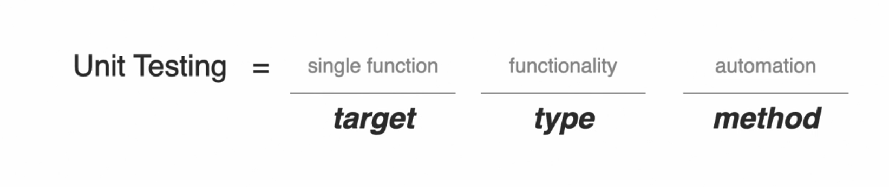
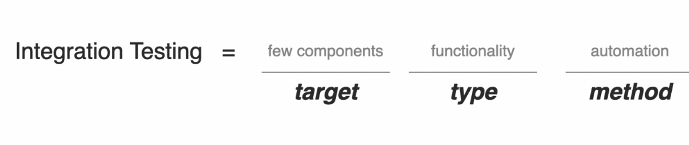
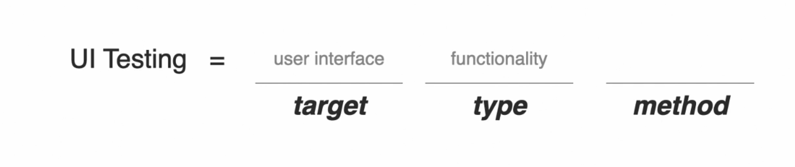
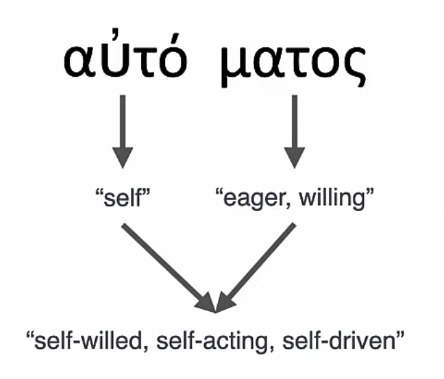
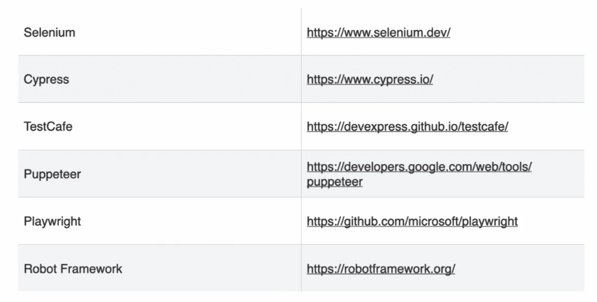
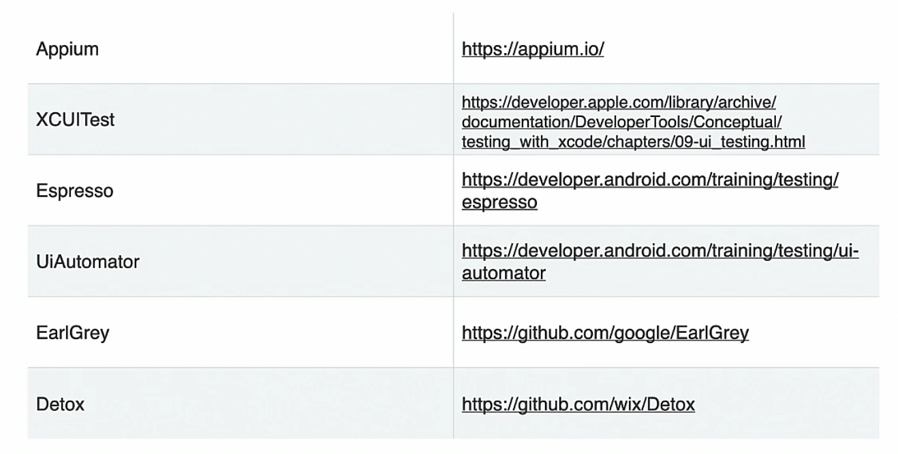
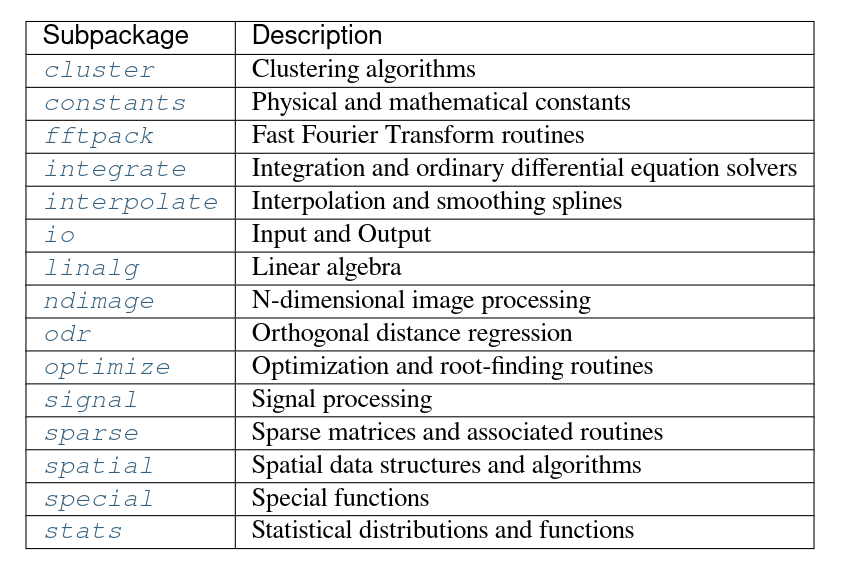

- Setup and Env
  collapsed:: true
	- **Miniforge [@](https://github.com/conda-forge/miniforge)**
	- **Mamba [@](https://mamba.readthedocs.io/en/latest/)**
- Fundamenals
  collapsed:: true
	- Data Types
	  id:: 64ef8957-f8e7-404c-96d3-2a334ae23ba6
	- Data Structures
	- Design Patterns
- Standard Template Library
- Statistical & Deep Learning
  collapsed:: true
	- Numpy
	- Pandas
	- Scikit Learn
	- Matplotlib
	- OpenCV
	- Tensorflow
	- PyTorch
	- ROS2
- Web Application Development
  collapsed:: true
	- Django-Rest
- Cloud Computing: SDKs
  collapsed:: true
	- Google cloud platform
	- Amazon web services
- Quality Assurance
  collapsed:: true
	- Testing
	  collapsed:: true
		- > The act of defining, building, and executing processes that determine application quality.
		- Types Dev < -- > QA (3D)
		  collapsed:: true
			- Target
			  collapsed:: true
				- Layer/Component of app being tested.
				- Isolated units, API
				- UI {unit, api, integration, ui}
			- Types
			  collapsed:: true
				- > what aspect of apps quality to be tested
				- performance, functionality, accessibility
			- Methods
			  collapsed:: true
				- Manual
				- Automated
			- Dev Flows
			  collapsed:: true
				- Test Driven Development
				- Test Post Development
		- Unit Testing
		  collapsed:: true
			- test isolated (mostly by mocking external 
			  code to the code tested) from interactions with other units of code. Be it internal code like a helper function made to clean the code, a call to the database or a call to an external API
			- 
		- Integration testing [e.g. communicating services]
		  collapsed:: true
			- tests without isolating them from interactions with other units
			- 
		- e2e
		  collapsed:: true
			- integration tests that test the end to end flows
		- UI Testing [aka. e2e, functional, integration]
		  collapsed:: true
			- 
	- Test Framework [PyTest]
		- e.g.confirm catching of exception
		  collapsed:: true
			- ```python
			  class TestXyz:
			  	
			      def test_confirm_exception(self):
			      	error = None
			          try:
			          	unit_creating_xceptn(i/p)
			          except Exception as e:
			          	error = e
			          assert error is not None
			  ```
			- ```python
			  import pytest
			  class TestXyz:
			  	
			      def test_confirm_exception(self):
			        with pytest.raises(Exception) as exc_info:
			      		unit_creating_xceptn(i/p)
			        assert 'o/p string' in str(exc_info)
			  ```
		- **PyPI package name**: [pytest](https://pypi.org/project/pytest/), [@Docs]( https://buildmedia.readthedocs.org/media/pdf/pytest/latest/pytest.pdf)
		- > "to write small, readable tests, and can
		  scale to support complex functional testing for applications and libraries"
		- Setup & ...
			- `pytest` : run tests
			- `pytest -q` : quiet reporting mode
			- `-k <expression>`: matches a file, class or function name inside the tests folder that contains the indicated expression.
			- `-m <marker>`: will run all tests with the inputed marker.
			- `-m "not <marker>"`: will run all tests that don’t have the inputed marker.
			- `-x`: stops running tests once a test fails, letting us stop 
			  the test-run right there so we can go back to debugging our test instead
			   of waiting for the test suite to finish running.
			- `--lf`: starts running the test suite from the last failed 
			  test, perfect to avoid continiously running tests we already know pass 
			  when debuggin.
			- `-vv`: shows a more detailed version of a failed assertion.
			- `--cov`: show % of tests covered by tests (depends on `pytest-cov` plugin).
			- `--reruns <num_of_reruns>`: used for dealing with [flaky tests](https://docs.pytest.org/en/stable/flaky.html), tests that fail when run in the test suite but pass when run alone.
			- *pytest.ini*
			  collapsed:: true
				- ```
				  [cfg]
				  ```
		- Fixtures : Test fixtures to find bugs, not to prove there are no bugs
		- ## Unit Testing
		  collapsed:: true
			- Mocking : creating units simulating the behavior of real units.
			- Stubbing : minimally simulated units.
		- Automation
		  collapsed:: true
			- etymology
			  collapsed:: true
				- 
			- behind |timeline| ahead
			  collapsed:: true
				- Mechanical automation
				- Industrial automation Powered by oil, steam, electricity ; backbone of social production and labour
				- Electrical and Digital circuits Automation(logic gates) -> binary digit (speed of electricity)
				- Information automation and software as automation.
				- AI Test Automation
			- Approaches
			  collapsed:: true
				- specialized s/w designed to record and playback
				- **automation scripts for application behaviors**
		- Testing [Web|Mobile] Automation
			- Web Browser tools
			  collapsed:: true
				- 
				- Selenium: Official W3 Consortium browser automation standard
			- Mobile tools
			  collapsed:: true
				- 
- Logging
  collapsed:: true
	- StructLog
- Database
  collapsed:: true
	- Redis
	- PostgreSQL
- Miscellaneous
  collapsed:: true
	- Scripting
	- Celery Task Queuing
- Packages
  collapsed:: true
	- **Numpy**
	- **Matplotlib**
		- Anatomy of a figure
		  collapsed:: true
			- {:height 550, :width 542}
		- rcParams (set global figure parameters)
		  collapsed:: true
			- ```matplotlibrc
			  # Figures
			  rcParams["figure.figsize"] = 45, 15
			  rcParams["figure.titlesize"] = "large"
			  rcParams["figure.labelsize"] = "normal" 
			  rcParams["figure.dpi"] = 100
			  rcParams["figure.raise_window"] = True
			  
			  # Font
			  rcParams["font.style"] = "italic"
			  rcParams["font.variant"] = "normal"
			  rcParams["font.weight"] = "lighter"
			  rcParams["font.stretch"] = "condensed"
			  rcParams["font.family"] = "monospace"
			  rcParams["font.serif"] = ["Bitstream Vera Sans Mono"]
			  rcParams["font.size"] = 16
			  
			  # Line Plot
			  rcParams['lines.linewidth'] = 3
			  rcParams['lines.linestyle'] = "-"
			  
			  # Axes
			  rcParams["axes.facecolor"] = "white" 
			  rcParams["axes.edgecolor"] = "black"
			  rcParams["axes.titlelocation"] = "center"
			  
			  # Dates
			  rcParams["date.autoformatter.day"] = "%Y-%m-%d"
			  
			  # Ticks
			  rcParams["xtick.major.size"] = 5
			  rcParams["xtick.minor.size"] = 3
			  rcParams["xtick.alignment"] = "center"
			  rcParams["ytick.major.size"] = 5
			  rcParams["ytick.minor.size"] = 3
			  rcParams["ytick.alignment"] = "center"
			  
			  # Grids
			  rcParams["grid.linestyle"] = "-"
			  
			  # Legend
			  rcParams["legend.frameon"] = False
			  rcParams["legend.facecolor"] = "inherit"
			  rcParams["legend.fancybox"] = False
			  ```
			- full config [@](https://matplotlib.org/stable/users/explain/customizing.html)
		- Seaborn ( set asthetics )
		  collapsed:: true
			- ```python
			  sns.set_style("whitegrid")
			  sns.set_palette("muted")
			  ```
		- A standard figure template
		  collapsed:: true
			- ```python
			  y = np.random.rand(10)
			  x = pd.date_range("2022-01-01", periods=10)
			  
			  fig, ax = plt.subplots()
			  
			  ax.plot(x,y)
			  ax.set_xlabel("x label")
			  ax.set_ylabel("y label")
			  ax.set_title("sample figure title")
			  ax.legend(["sample legend"])
			  ax.grid(True)
			  ax.set_xticklabels(ax.get_xticks(), rotation=50)
			  ax.autoscale()
			  plt.show()
			  plt.close(fig)
			  ```
	- **SciPy**
	  collapsed:: true
		- 
	- **Tensorflow**, **PyTorch**
	- **Django**
- Resources | References
  collapsed:: true
	- [Python3](https://docs.python.org/3/)
	- [Notes on python](https://books.goalkicker.com/PythonBook/PythonNotesForProfessionals.pdf)
	- [SciPy](https://docs.scipy.org/doc/scipy-1.8.1/scipy-ref-1.8.1.pdf), [Numpy](https://docs.scipy.org/doc/numpy-1.17.0/numpy-ref-1.17.0.pdf)
	- [Matplotlib](https://matplotlib.org/Matplotlib.pdf) | [Seaborn](https://seaborn.pydata.org/)
	- [Django](https://django.readthedocs.io/_/downloads/en/stable/pdf/)
	- [Scikit-Learn](https://scikit-learn.org/stable/user_guide.html)
	- [PyTorch](https://pytorch.org/docs/stable/index.html), [Tensorflow](https://www.tensorflow.org/api_docs/python/tf)