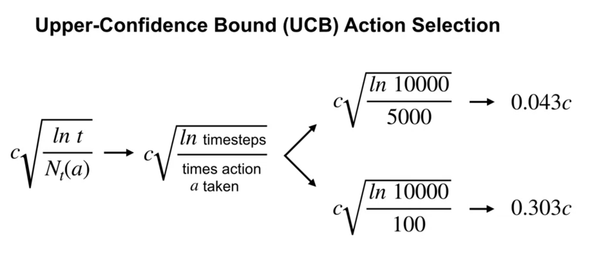

- K-arm bandit
  collapsed:: true
	- Each of $k$ actions in a $k-arm$ bandit problem has an expected or mean reward given that action $A_t$ is selected at time step $t$ and corresponding reward $R_t$,  termed as *value* of that arbitrary action, denoted $q_{*} (a)$ and is given as :
	  
	  $$
	  \boxed{
	  q_{*} (a) \dot{=} \mathbb{E} [ R_t | A_t = a]
	  } -- (1)
	  $$
	- **Action-Value Estimation with sample-average:** The estimated value of action $a$ at time step $t$ as $Q_t(a)$ is to be close to $q_* (a)$ and is given as :
	  collapsed:: true
		- $$
		  \boxed{
		  Q_{t} (a) \dot{=} \frac{\sum_{i=1}^{t-1} R_i.\mathbb{l_{A_i=a}}}
		                     {\sum_{i=1}^{t-1}\mathbb{l_{A_i=a}}}
		  } -- (2)
		  $$
		- where $l_{predicate}$ is random variable, viz. is *1* if predicate is true and *0* else.
	- **greedy action (Argmax):**
	  collapsed:: true
		- $$
		  \boxed{A_t = \underset{a}{argmax} Q_t(a)} -- (3)
		  $$
		- always exploits current knowledge to maximize immediate reward
	- **Action-value Estimation Incrementally**
	  collapsed:: true
		- Rewrite eq. (1) as:
			- $$
			  Q_{n} = \frac{R_1 + R_2 + R_3 + ... + R_{n-1} } {n-1} 
			  $$
			- $$
			  Q_{n+1} = 1/n \sum_{i=1}^{n} R_i
			  $$
			- $$
			  \boxed{Q_{n+1} = Q_n + 1/n [R_n - Q_n]} -- (4)
			  $$
		- Only memory of previous state $(n-1)$ is needed for $Q_n$ compute.
	- **General update rule of form :**
	  collapsed:: true
		- $$
		  \boxed{NewEstimate \leftarrow OldEstimate + StepSize [Target - OldEstimate]}
		  $$
		- $$
		  \boxed{Q_{n+1} = Q_n + \alpha_{n} [R_n - Q_n]} -- (5)
		  $$
			- where $\alpha \rightarrow [0, 1]$ is a fn. in b/w.
			- i.e. OldEstimate with addtitional step indicated by error term.
	- **Non-Stationary Cases**
	  collapsed:: true
		- The distribution of reward changes over time.
		- Setting the step size parameter constant.
		- Decaying past rewards
		- $$
		  \boxed{Q_{n+1} = (1 - \alpha)^n Q_1 + \sum_{i=1}^n 
		            \alpha (1- \alpha)^{n-i} R_i} -- (6)
		  $$
	- $\epsilon - greedy$ **action Selection :** to deal with Exploration-Exploitation dilemma
	  collapsed:: true
		- $\epsilon$ is usually small choose to explore probability
		- $1- \epsilon$ is the rest of the greedy action probability
		- {:height 286, :width 723}
		- random action from a stationary distribution
	- **Optimistic Initial Values**
	  collapsed:: true
		- From higher initial optimistic values to Optimal action-values with a bit of encouraged exploration in early phase of learning.
		- ! only drives exploration early in learning, for non-stationary problems then the later part becomes greedy, not known optimistic initial value assumption
	- **Upper-Confidence-Bound (UCB) Action selection**
	  collapsed:: true
		- $$
		  A_{t} \dot{=} \underset{a}{argmax} \left[ Q_t(a) + c \sqrt{{\frac{\ln t}{N_t(a)}}} \right] 
		  $$
		- The more uncertainty about choosing an action, more the need to explore that action.
		- 
		- As: Max [Exploitation + Exploration]
		- 
		- This favours uncertainty term for the actions that are explored less with a user specified exploration parameter $c$.
	- **Gradient Bandit Algorithms**
	  collapsed:: true
		- Considering numerical preference for each action a, $H_t(a)$. larger preference results the selection of action's frequently but has no impact on rewards, relative preference of one action to the other are important
		- action probabilities are evaluated as Softmax (i.e. Gibbs or Boltzmann distribution)
			- $$
			  \boxed{
			  P(A_t = a) \dot{=} \frac{e^{H_t(a)}}{\sum_{b=1}^{k} e^{H_t(b)}} \dot{=}  \pi_t (a)
			  }
			  $$
			- where $\pi_t(a)$, probability of taking action $a$ at time $t$. initial probability of selection for all $H_1(a) = 0$
	- **Associative Search (Contextual Bandits)**
	  collapsed:: true
		- It involves learning both via trail and error to search best action and association of these actions with the situations in which they are best.
	- **Summary**
		- E-greedy methods choose randomly a fraction of probability selection.
		- UCB deterministically calculate exploration by fractional favor towards action with fewer samples.
		- Gradient bandit estimates not action values but action preference, and favor the more preferred actions in a graded, probabilistic manner using a soft-max distribution.
		- Optimistic initialization of the estimates causes greedy methods to explore
		- Parameter plotting as function of the performances shows a relative comparison between methods.
		- Gittins index, if full knowledge of prior distribution is available. the update computation can be complex, except for some special distributions (conjugate priors), is easy. this method is a.k.a. posterior sampling, thompson sampling.
	- **Exercise**
	  collapsed:: true
		- **2.1**
		  collapsed:: true
			- 
			- probability of e-greedy action selection = 0.5, so for greedy action selection 1-e = 0.5 ?
		- **2.2**
- Markov Decision Processes
  id:: 6523bc58-d012-4eb8-8999-4559c91141b1
  collapsed:: true
	- Terminologies
	  collapsed:: true
		- MDP
		- Types
		- Trajectory | Episode
		- Reward | Return
		- Discount Factor
		- Policy
		- State Values | Action Values
		- Bellman Equations
		- MDP Solution
	- A MDP model contains:
	  collapsed:: true
		- A set of possible world states $S$
		- A set of possible actions $A$
		- A real valued reward function $R(s,a)$
		- 
		- assumptions:
			- Fully observable Environment
			- Finite set of States
	- Markov Property
	  collapsed:: true
		- > "The future is independent of the past, given present"
		- A state $S_t$ is Markov $iff$:
			- $$
			  \boxed{
			  \mathbb{P}[S_{t+1} | S_t ] = \mathbb{P}[S_{t+1} | 1, ..., S_{t-1} , S_t ]
			  }
			  $$
		- A state transition Matrix( Probability of state transition )
		  id:: 6530f28a-0528-4794-bdd9-d0c8bf01515c
			- $$
			  P_{ss^{'}} = \mathbb{P}[S_{t+1} = s^{'} | S_t = s]
			  $$
			- Where $s^{'}$ : successor state and the transition matrix is the probability of state transitions from current ($s$) to successor states($s^{'}$)
			- 
	- Markov Process
	  collapsed:: true
		- A Tuple $(S, P)$
			- $S$ is finite set of states
			- $P$ is state transition probability matrix
				- ((6530f28a-0528-4794-bdd9-d0c8bf01515c))
	- Markov Reward Processes
	  collapsed:: true
		- A Tuple $(S, P, R, \gamma)$
			- $S$ is finite set of states
			- $P$ is state transition probability matrix
				- ((6530f28a-0528-4794-bdd9-d0c8bf01515c))
			- $R$ is a reward function 
			  
			  $$
			  \boxed{
			  R_{s} = \mathbb{E}[R_{t+1} |S_{t} = s]
			  }
			  $$
			- $\gamma$ is a discount factor where $\gamma \in [0,1]$
			  
			  0: only next dependency, 1: infinite
	- Value Functions $v(s)$
	  collapsed:: true
		- $$
		  \boxed{
		  v(s) = \mathbb{E} [G_t | S_t = s]
		  }
		  $$
		  
		  Where the R.H.S. is the expected return starting from state $s$.
		- State-Value Function
		- Action-Value Function
	- Bellman Equation
	  collapsed:: true
		- $$
		  \boxed{
		  v(s) = \mathbb{E}[R_{t+1} + \gamma v(S_{t+1}) | S_t = s]
		  }
		  $$
		- Decomposition of value function :
			- immediate reward $R_{t+1}$
			- discounted(parameterized/weight-ed) value of successive states $\gamma V(S_{t+1})$
		- In Matrix form:
			- $$
			  \boxed{v = R + \gamma P_{ss^{'}}.v}
			  $$
	- Markov Decision Process
	  collapsed:: true
		- A Tuple $(S, A, P, R, \gamma)$
			- $S$ is finite set of states
			- $A$ is finite set of actions
			- $P$ is state transition probability matrix $P_{ss^{'}}^{a}$
			- $R$ is a reward function 
			  
			  $$
			  \boxed{
			  R_{s}^{a} = \mathbb{E}[R_{t+1} |S_{t} = s, A_{t} = a]
			  }
			  $$
			- $\gamma$ is a discount factor where $\gamma \in [0,1]$
			  
			  0: only next dependency, 1: infinite
	- Policies
	  collapsed:: true
		- a policy is a distribution of actions given states.
			- $$
			  \pi(a|s) = \mathbb{P}[A_t = a | S_t = s]
			  $$
			  
			  "a policy fully defines behavior of an agent"
			  
			  assuming, policies are stationary(time-independent), $A_t \sim pi(.|S_t), \forall t > 0$
- Monte Carlo Methods
  collapsed:: true
	- MC. Control Task Solution
	- On-Policy MC control.
- Temporal Difference Methods
  collapsed:: true
	- MC vs TD Methods
	- SARSA
	- Q-Learning
- N-Step (TD) Bootstrapping
  collapsed:: true
	- How value of no. of steps affects bias and variance.
	  collapsed:: true
		- 
- Policy Gradient Methods
  collapsed:: true
	- Previous methods are value-based are better suited for deterministic policies but are not able to effectively represent stochastic policies.
	- Policy Gradient Methods
	  collapsed:: true
		- Use of a function approximators (NNs) to estimate the probabilities of taking each action.
		- The policy changes more smoothly during learning relative to value-based policies.
		- 
	- Policy performance
	  collapsed:: true
		- Comparison of one policy over the other by defining performance measures. The policy is a function  $J(\theta)$ of neural network parameters $\theta$, i.e. different parameters  combination of network result in comparable policies.
		- The goal is to find optimal policy by finding optimal parameters, using gradient ascent, that maximizes performance of a policy.
		  collapsed:: true
			- $$
			  \boxed{
			      \pi _{*}(a | s, \theta) = \arg \max_{\theta} J(\theta)
			  }
			  $$
		- Update ($\theta$)
		  collapsed:: true
			- $$
			  \boxed{
			      \theta _{t+1} = \theta _{t} + \alpha \nabla \hat{J} (\theta)
			  }
			  $$
			  
			  where performance w.r.t parameters, $\nabla \hat{J} (\theta) \in \frac{\partial \hat{J} (\theta)}{\partial \theta _{n}}$ for $n$ combinations.
	- Policy Gradient Theorem
	  collapsed:: true
		- 
		-
- Parallel learning
  collapsed:: true
	- using batch of random experiences[ state transitions that the agent experienced ] (experience replay buffer)
	- using vectorized environments, that the agent will interact at the same time.
	- agent receives states from each environment as a column vector and independently chooses action for each states with a resulting action column vector is passed to the parallel environment. as in a case of sing environment, the environment will return two column vectors with next states and the rewards obtained respectively.
- Entropy regularization: to encourage exploration, entropy is added.
  collapsed:: true
	- $$
	  \boxed{
	      \theta _{t+1} = \theta _{t} + \alpha [ \gamma ^{t} G _{t} \ln \nabla \pi(A_{t} | S_{t}, \theta _{t}) + \beta \nabla H(\pi) ]
	  }
	  $$
- REINFORCE [ Policy Gradient + Monte Carlo ]
  collapsed:: true
	- It is a Monte Carlo variant of a policy gradient algorithm. The agent collects samples of an episode using its current policy, and uses it to update the policy parameter. Since one full trajectory must be completed to construct a sample space, it is updated as an off-policy algorithm.$_{[4]}$
	- $$
	      \boxed{
	          \nabla _{\theta} J(\theta) = \mathbb{E} _{\pi} [ G _t \nabla _{\theta} \ln \pi _{\theta} (A_t | S_t)]
	  }
	  $$
	- Discrete action space
	  collapsed:: true
		- Model of action probabilities distribution per action basis.
		- MLP policy resulting with softmax action i.e.probability for each action.
	- Continuous action space
	  collapsed:: true
		- Model of action probabilities using a continuous probability distribution.
		- Policy instead results in mean and standard deviation of a probability distribution, from which the action are sampled.
- Vanilla Policy gradient:
  collapsed:: true
	- 
- A2C, A3C
- TRPO (Trust Region Policy Optimization)
  collapsed:: true
	- It is a policy gradient method that avoids parameter update that change the policy too much by tracking (KL)Kullback Leibler divergence constraints on the size of the policy update at each iteration $_{4}$.
	- Handcrafted features, fixed_sized hyperparams.
- PPO (Proximal Policy Optimization)
  collapsed:: true
	- A refinement of TRPO
	- Uses Simpler clipped surrogate objective
	- Mind the Implementation details
		- Vectorized Architecture: sample collection from multiple environment by a single learner.
		  logseq.order-list-type:: number
		- logseq.order-list-type:: number
- SAC (Soft Actor Critic)
  collapsed:: true
	- 
- TD3 (Twin Delayed Deep Deterministic Policy Gradient)
- **References:**
  collapsed:: true
	- [1]. [Reinforcement Learning: An introduction (Second Edition) by Richard S. Sutton and Andrew G. Barto](https://mitpress.mit.edu/9780262039246/reinforcement-learning/)
	- [2]. [OpenAI Spinning Up](https://spinningup.openai.com/en/latest/)
	- [3]. https://paperswithcode.com
	- [4]. {{video https://www.youtube.com/watch?v=2pWv7GOvuf0&list=PLqYmG7hTraZDM-OYHWgPebj2MfCFzFObQ&pp=iAQB}}
	- [5]. {{video https://www.youtube.com/watch?v=2GwBez0D20A&list=PLwRJQ4m4UJjNymuBM9RdmB3Z9N5-0IlY0&pp=iAQB}}