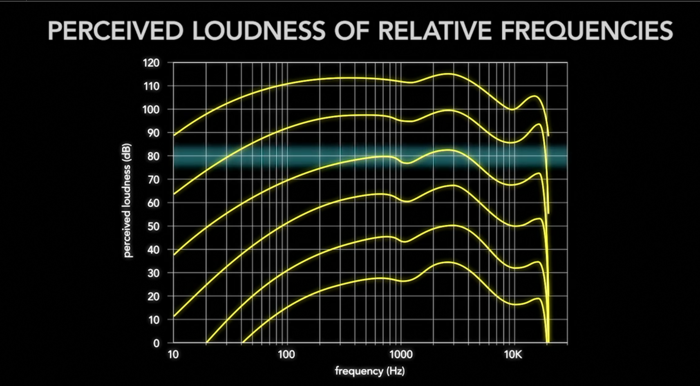

- Tags
  collapsed:: true
	- > Acoustics, Analog, & Digital domains of Audio
	- > AudioEngineering, MusicProduction, SoundRecording
	- > Music Theory, Improvisation, Mix, Composition
	- > Bitwig, MuseScore, Audacity, ...
- *Marker*
  collapsed:: true
	- > "Music is about feeling and thinking, Recording is a art and a science, so both Scientific and Artful. Telling tales with sound with brave and artistically honest expression, <3 "
	- > "An imperfect excellence can be more meaningful than plastic perfection"
- Audio Foundations 🕪🎛️🎤
  collapsed:: true
	- **Frequency Spectrum References**
	  collapsed:: true
		- ElectroMagnetic Spectrum Reference [Fig]
		  collapsed:: true
			- {:height 348, :width 550}
		- Auditory Spectrum Reference [Fig]
		  collapsed:: true
			- 
		- Frequency Spectrum of Instruments [Fig]
		  collapsed:: true
			- {:height 400, :width 727}
		- > Sound travels 4X faster in water & 15X faster in solid Iron (~approx), than it does in air.
	- **Fundamentals**
	  collapsed:: true
		- How we Hear [Gif]
		  collapsed:: true
			- {:height 291, :width 550}
			  collapsed:: true
				-
		- Domains of Sound
		  collapsed:: true
			- Acoustic [ Where sound plays ]
			- Analog (e.g. Devices: Vynl, Tape, Microphone)
			- Digital
		- Frequency & Amplitude
		- Phases & Time
		  collapsed:: true
			- {:height 388, :width 550}
		- Relative Phases
		  collapsed:: true
			- Comb filtering [Mixing(Interference) sound with the delayed copy of itself.]
			  collapsed:: true
				- 
					-
			- Change/Invert Polarity, ...
	- **Measures**
	  collapsed:: true
		- Air pressure Reference ( Barometer unit: pascals )
		- dB (Decibels) [Logarithmic ratio of comparison],  as unit of measure by defining reference point Sound pressure level (SPL) [Fig]
		  collapsed:: true
			- {:height 377, :width 550}
		- > Remark : for recording and mixing most of the time, boosting/reducing an audio signal by 6dB doubles/halves the amplitude of that signal.
	- **Audio Signal Path**
	  collapsed:: true
		- Acoustic & Analog Domains
		  collapsed:: true
			- e.g. Live Sound ( Microphone `--vocal->` Speaker) [Fig]
			  collapsed:: true
				- Sound waves exist in Acoustics domain
				- 
				- The Acoustic wave oscillates *Microphone*'s diaphragm back and forth,  which are then interpreted as positive and negative electric signals. i.e. `mic-level` signal(low-voltage).
				- This signal is boosted by a pre-amplifier in channel `Mixer`  into `Line-level` signal(low-voltage).
				- This low level signals is boosted by power Amplifiers to convert them to `speaker-level` signal( high-voltage).
				- This signal is then run through a coil of wire, induce magnetism, which oscilates the magnet attached to the paper cone, creating Sound waves in Acoustic Domain.
			- e.g. Recorded Sound ( Microphone `--AnalogRecord/Replay-->` Speaker )
			  collapsed:: true
				- Record [Fig]
				  collapsed:: true
					- {:height 219, :width 654}
				- Replay [Fig]
				  collapsed:: true
					- 
			- The transduction from acoustic to analog signals are altered due to factors. some for Microphone
			  collapsed:: true
				- Room Acoustics and Positioning (reverb. etc.)
				- Directionality and Proximity effect
				- Transient effect [Fig]
				  collapsed:: true
					- 
				- Frequency Response
				- Signal to Noise Ratio
			- Types of Analog Connections [Fig]
			  collapsed:: true
				- {:height 302, :width 519}
			- Gain Stage
			  collapsed:: true
				- Be aware of SNR, Threshold of Amplifier, balanced margin at each downstream gain stages.
			- Metering
			  collapsed:: true
				- dB Reference Points [Fig]
					- {:height 277, :width 488}
			- Monitoring [ Sending Out to Acoustic domain ]
				- Fletcher-Munson equal loudness contours [Fig]
				  collapsed:: true
					- > Human ears hear bass and treble frequencies more easily at higher volumes, and midrange frequencies more easily at lower volumes
					- 
						- Usually preferred b/w ~(77 to 83) dB SPL
				- Critical Variables in the acoustics [Fig]
				  collapsed:: true
					- {:height 403, :width 716}
		- Digital Domain
		  collapsed:: true
			- Signal path in digital domain [Fig]
			  collapsed:: true
				- 
			- ADC (Analog-to-Digital converter)
			  collapsed:: true
				- Sampling
				  collapsed:: true
					- Sampling rate/frequency
					  collapsed:: true
						- > common sampling rates : `44.1Khz`, `48Khz`
					- **Nyquist frequency** and Anti Aliasing Filters [Fig]
					  collapsed:: true
						- 
						- Aliasing Distortion
					- Quantization of Samples with a  precision represented by `bit-depth`
					  collapsed:: true
						- Bit-Depth [Fig]
						  collapsed:: true
							- Most common :
							  collapsed:: true
								- `16` bit [ $2^{16}$ = 65,536 divisions of possible quantization in amplitude range of the signal ] (std. CDs)
								- `24` bit [ $2^{24}$ ] (HD formats)
							- 
							  collapsed:: true
								-
				- Gain Stages
				  collapsed:: true
					- Could run out of available quantization level. Any sound gets louder than digital-full-scale 0 dB FS will get clipped.
				- Quantization distortion & Dither
				  collapsed:: true
					- lower bit-depth sampling can cause it.
					- Dither Noise-shaping EQ
			- DAC (Digital-to-Analog converter)
			  collapsed:: true
				- Sample reconstruction based on sample rate.
				- Digital Storage Formats
				  collapsed:: true
					- Data Compression
					  collapsed:: true
						- Uncompressed [e.g. WAV, AIFF]
						- Losslessly-Compressed [e.g. FLAC (Free Lossless Audio Codec), ALAC]
							- CODEC ( Compressor/ De-compressor)
						- Lossy-Compressed  [e.g. Mp3, AAC, WMA, Ogg Vorbis, ... ]
						  collapsed:: true
							- Usually adapted to human, psyco-acoustics to prioritize what to keep and loose.
							- Resulting file varied with `bit rate`
							  collapsed:: true
								- Number of bits per second, the codec is allowed to use to store the audio.
								- Measure : kbps
									- > Common : 128, 192, 256, 320 kbps.
				- Types of Digital Connections
				  collapsed:: true
					- 
						- USB
							- Audio Interface Signal path [Fig]
							  collapsed:: true
								- 
								-
						- AES/EBU, S/PDIF
	- **Devices**
	  collapsed:: true
		- A *Transducer*, device that change energy from one form to another  ( Transform + Conduct )
		- Microphone
		  collapsed:: true
			- A type of Transducer. Acoustic  `--into-->`  Analog.
		- Speaker
		  collapsed:: true
			- A type of Transducer. Analog Electric signals `--into-->` Acoustic
		- > ! A `feedback-loop`, sound from speaker is picked up by the connected microphone creating loop and amplifying it's own output.
		- Storage
		  collapsed:: true
			- e.g. 48 kHz, 24-bit audio requires
			  collapsed:: true
				- 48,000 samples/sec `x` 3 bytes/sample `x` 60 sec per min = 8, 640,000 bytes/min/per mono audio track.
	- **Digital Audio Workstations** [DAW]
	  collapsed:: true
		- > Non-liner recording & Non-destructive editing than analog equipments.
		- Types of DAW [Fig]
		  collapsed:: true
			- {:height 372, :width 716}
		- Effect Plugins
		  collapsed:: true
			- e.g. Reverb, Delay & Echo, EQ, Compressor, Pitch shifter, Amp. simulator, Phaser, ...
		- Virtual( Software ) Instruments
		  collapsed:: true
			- Synthesizers : Render sounds using math
			- Samplers : Playback recordings of notes
		- Misc. Plugins
			- Hardware, ADC/DAC plugins, ....
			- > Common plug-in formats : Audio units, VST, AAX, RTAS, MAS, DirectX, LADSPA, LV2, ...
	- **MIDI**
	  collapsed:: true
		- Musical Instrument Digital Interface
		- Instructions to create a performance not a sound itself. Sound produced by synthesizer, samplers, virtual instruments, lighting, mixers etc., that takes those instructions.
		- Communication MIDI
		  collapsed:: true
			- [Fig]
			  collapsed:: true
				- 
		- Powerful manipulation of notes in pitch and time
	- **Mixing & Audio Processing**
	  collapsed:: true
		- Mixing
		  collapsed:: true
			- Levels [Volume level of tracks relative to each other]
			  collapsed:: true
				- > reminder: good gain practices
			- Pan [Spacious placement of audio tracks in acoustic domain] ( panorama )
			  collapsed:: true
				- Important factors to consider while panning
				  collapsed:: true
					- One ear compatibility [pan tracks close to the center]
					- Mono compatibility
					- Bass management
			- Automation [Create changes over time to volume, panning, ... different aspect of mix ]
			- Monitoring Levels
				- e.g. Standard of mixing audio in film & video
					- sound played -20 dB FS sounds 83 dB SPL Acoustically.
			- Partials, Harmonics & Equalization (EQ)
				- Following ingredient frequencies : Partials
				- Lowest partial : Fundamental frequency ( influences the overall pitch of the sound )
				- Others partials ( influences tone and shape of sound waveform  ) :
				  collapsed:: true
					- Harmonic partials ( simple mathematical relation[e.g. multiple] to fundamental frequency )
					- Non-Harmonic partials ( complex or not mathematically related to `f`)
					- Overtones
				- Equalization (EQ)
				  collapsed:: true
					- Alters the relative amplitude of different frequency range.
					- Types of EQ Components
						- Low/High Pass filter
							- Steepness/Slope (dB/Oct) : Attenuation/Octave
						- Shelf filters [Fig]
						  collapsed:: true
							- 
							  collapsed:: true
								- Frequency : center of the transition to the shelf
								- Amount the shelf will boost or cut : Gain
						- Parametric EQ
							- 
								- Center Frequency, Gain, Width of the filter
		- Effect and Dynamic Processors
		  collapsed:: true
			- Dynamic range compression
			- Types of Dynamic processors [Fig]
			  collapsed:: true
				- 
			- Shared Parameters:
				- Threshold ( watch on volume/amplitude )
				- Ratio of the response after the threshold condition is met. e.g 2:1 i.e. half of it is cutoff for every double value above threshold.
				- Attack and Release
				  collapsed:: true
					- Attack always affects sounds louder that the threshold and Release quieter than threshold.
				- Knee ( smooth shape of the processor )
				- Sidechain : Processor watches the sidechain signal and compare it to the threshold but control the actual volume of main signal.
		- Reverb, Echo & Delay
			- Copies of sound repeated over time to enhance sonic space
			- Reverb
			  collapsed:: true
				- Reverb Chambers
				- Impulse response(IR)
		- Characteristics of Audio Signals
		  collapsed:: true
			- {:height 382, :width 716}
	- **Reference and Resources**
	  collapsed:: true
		- MIDI Reference
		- LinkedLearning