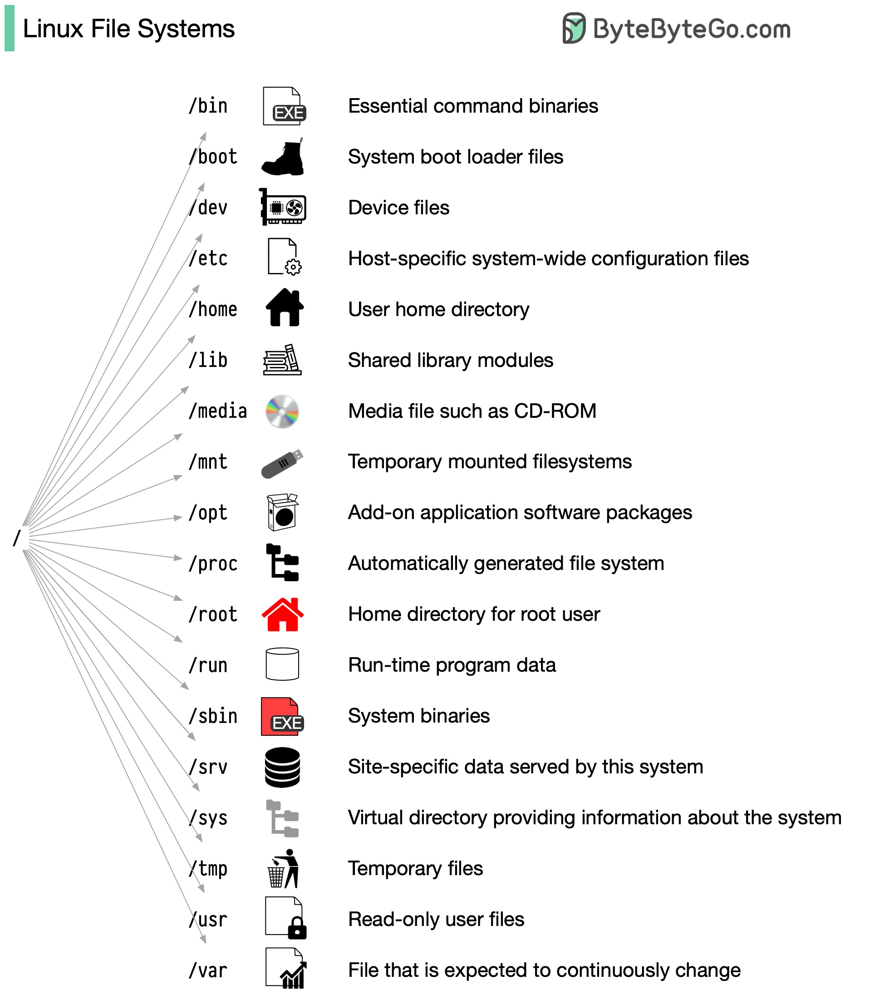

- ```
          _nnnn_
          dGGGGMMb
         @p~qp~~qMb
         M|@||@) M|
         @,----.JM|
        JS^\__/  qKL
       dZP        qKRb
      dZP          qKKb
     fZP            SMMb
     HZM            MMMM
     FqM            MMMM
   __| ".        |\dS"qML
   |    `.       | `' \Zq
  _)      \.___.,|     .'
  \____   ) MNPR |   .'
       `-'       `--'
  ```
- Filesystem: Graphics
  collapsed:: true
	- [@Bytebytego.com](https://github.com/ByteByteGoHq/system-design-101/blob/main/images/linux-file-systems.jpg)
	  collapsed:: true
		- 
- Systemctl : To manage services
	- systemctl offers various actions to manage services (systemd units) on systems using systemd as the init system. Here's a list of common actions:
	  
	  * **Start:** `sudo systemctl start <service_name>` - Initiates a service if it's not already running.
	  * **Stop:** `sudo systemctl stop <service_name>` - Halts a running service.
	  * **Restart:** `sudo systemctl restart <service_name>` - Stops a running service and then starts it again.
	  * **Reload:** `sudo systemctl reload <service_name>` - Attempts to reload the service configuration without stopping it (useful for configuration changes to take effect).
	  * **Status:** `sudo systemctl status <service_name>` - Shows the current state (running, stopped, etc.) and information about a service.
	  * **Enable:** `sudo systemctl enable <service_name>` - Configures a service to start automatically at boot.
	  * **Disable:** `sudo systemctl disable <service_name>` - Prevents a service from starting automatically at boot.
	  * **List:** `systemctl list-units --type service` - Lists all loaded service units.
	  
	  * `systemctl try-restart <service_name>`: Attempts to restart a service only if it's already running.
	  * `systemctl reload-or-restart <service_name>`: Tries to reload the configuration, restarting the service if reloading fails.
	  * `systemctl mask <service_name>`: Disables a service and prevents it from being started.
	  * `systemctl unmask <service_name>`: Re-enables a previously masked service.
	  
	  **Remember:** You'll often need `sudo` before these commands to perform actions requiring administrative privileges.
- Tools
  collapsed:: true
	- Debian
	  collapsed:: true
		- exiftool
		  collapsed:: true
			- ```
			  sudo apt install libimage-exiftool-perl
			  ```
			- ```
			  exiftool <image.jpg>
			  ```
			- ```
			  exiftool -recurse -all= <path of directory> # remove metadata
			  ```
			- ```
			  exiftool -overwrite_original -all= <image.jpg>
			  ```
			- ```
			  exiftool -EXIF= <image.jpg> # remove exif
			  ```
			-
	- Manjaro
	  collapsed:: true
		- pacman
		  collapsed:: true
			- Install `sudo pacman -Syu [PackageName]`
			- uninstall `sudo pacman -Rns [PackageName]`
			- search `pacman -Ss [PackageName]`
			- update/ check for update `sudo pacman -Syu`
	- AppImages
	  collapsed:: true
		- ```
		  chmod a+x App*.AppImage
		  ```
		- ```
		  ./App*.AppImage
		  ```
	- UFW(uncomplicated firewall): A simple firewall application